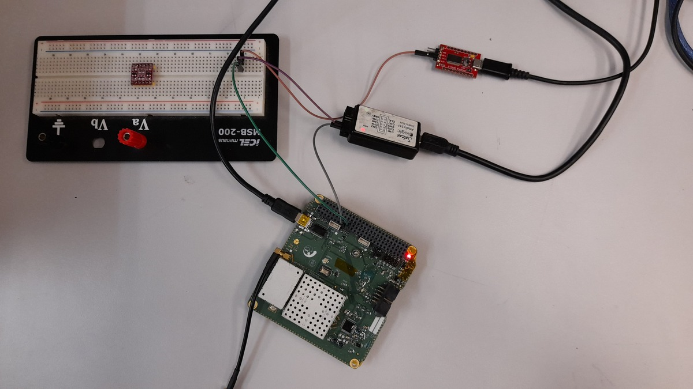
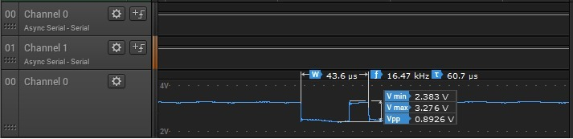
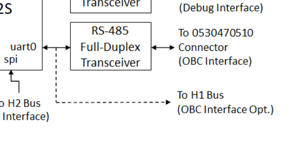
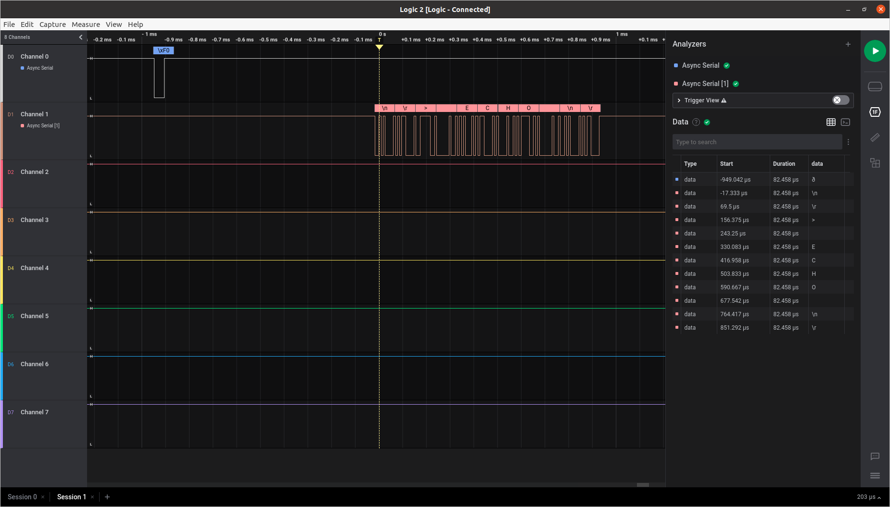
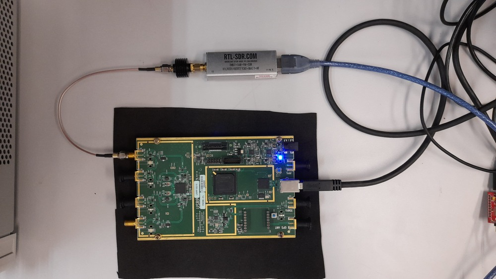
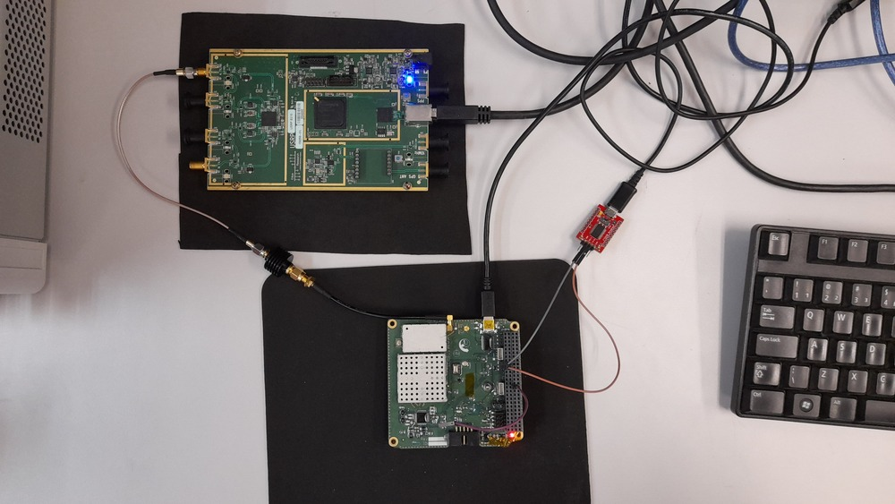
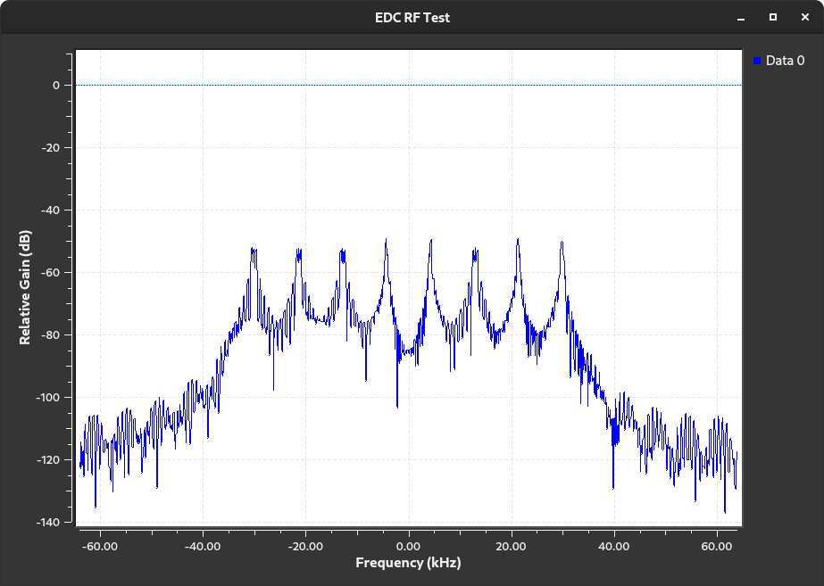
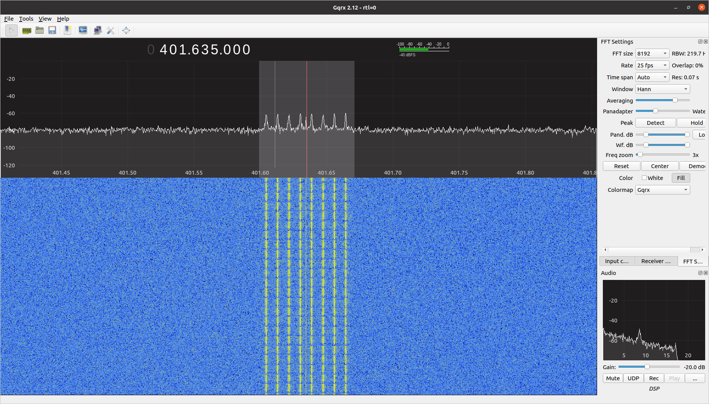
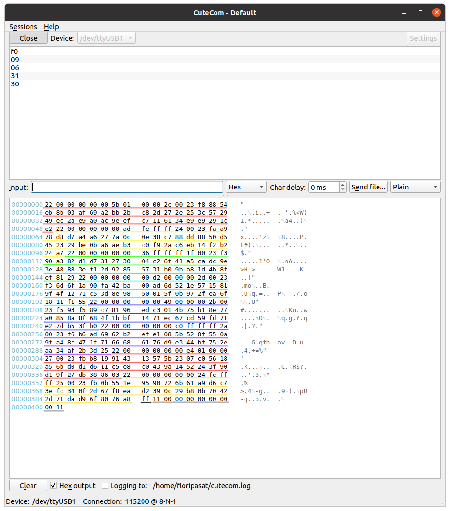

.. edc_report.rst

    Copyright The Catarina-A1 Contributors.

    Catarina-A1 Documentation

    This work is licensed under the Creative Commons Attribution-ShareAlike 4.0
    International License. To view a copy of this license,
    visit http://creativecommons.org/licenses/by-sa/4.0/.

.. _anx:edc-report:

***************
EDC Test Report
***************

This appendix is a test report of the EDC board. The purpose of this test is to characterize the main functionalities of the EDC module. The main information about the test is available below:

* **Date**: From 2022/03/03 to 2022/03/14
* **Testers**: Bruno Benedetti, Gabriel M. Marcelino, Laio O. Seman

A picture of the boards used during the tests can be seen in :numref:`fig:edc-boards-test`.

.. subfigure:: A|B
    :layout-sm: A|B
    :gap: 8px
    :subcaptions: below
    :name: fig:edc-boards-test
    :class-grid: outline
    :align: center

    .. image:: figures/edc_report/edcs-top.jpg
        :width: 100%
        :align: center
        :alt: Top side.

    .. image:: figures/edc_report/edcs-bottom.jpg
        :width: 100%
        :align: center
        :alt: Bottom side.

    Tested EDC boards.

This test is divided into two parts: the command interface test and RF chain test. Both are described below.

Command interface test
======================

The command interface test aims to test the UART command interface available in the PC-104 bus of the module. All available commands were tested in this test.

Used material
*************

The used material is listed below:

* EDC boards
* USB-UART converter
* Saleae Logic Analyzer
* Protoboard
* Desktop computer
* Logic 2 software
* Cutecom software
* USB cables
* Pin header wires
* EDC documentation

Setup
*****

The test setup can be seen in :numref:`fig:edc-test-setup`. As seen in the picture, the USB-UART converter connects the UART interface of the EDC directly to a computer. The EDC board is powered directly by its USB debug interface.

.. _fig:edc-test-setup:

   Setup of the EDC's command interface test.

To confirm and visualize the transmitted and received data, a logic analyzer is connected to the pins of the UART interface (TX and RX).

Results
*******

During the first attempts to perform this test, no responses were received from both boards, considering all the available commands. After further investigation with the module developers (INPE-CRN), the issue was found. As can be seen in :numref:`fig:edc-cmd-issue`, the voltage of the RX pin when in a low state is higher than expected, making all bits be interpreted as ones.

.. _fig:edc-cmd-issue:

   Command interface issue.

The hypothesis for the cause of this problem is the RS-485 transceiver. As seen in :numref:`fig:edc-bd-uart-if`, the RS-485 transceiver and the UART interfaces share the same UART port of the microcontroller. This way, the RS-485 transceiver can cause interference on the RX pin of the UART interface, forcing its state to be high all the time.

.. _fig:edc-bd-uart-if:

   UART and RS-485 interfaces of the EDC.

A solution to this problem is to disable the RS-485 transceiver by removing it from the board or putting the enable pin on a disabled state. As it would be difficult to remove this component from the boards safely, the second option was chosen. With a modification in the firmware, the RS-485 transceiver was disabled. After this modification, the UART command interface started to work as expected, as can be seen in :numref:`fig:edc-echo-cmd` ("echo" command).

.. _fig:edc-echo-cmd:

   "Echo" command demonstration.

RF chain test
=============

This test simulates a signal transmitted by a DCP directly to the RF input of the EDC module. To emulate the DCP signal, a GNURadio flow generates the packets, and an SDR transmitter transmits the packet to the EDC. This test is divided into two steps: in the first step, we check the transmitted signal by the USRP, and in the second step, the EDC reception and decoding are verified.

Used material
*************

The used material is listed below:

* EDC boards
* USB-UART converter
* Ettus USRP B210 SDR
* Desktop computer
* GNURadio v3.9
* Cutecom software
* USB cables
* Pin header wires
* SMA coaxial cable
* 30 dB attenuator
* RTL-SDR v3
* EDC documentation

Setup
*****

This test is divided in two steps. The setup of the first step can be seen in :numref:`fig:edc-stimulus-test`. As can be seen in the picture, the SDR transmitter is connected directly to an SDR receiver through a 30 dB attenuator.

.. _fig:edc-stimulus-test:

   Setup of the signal generator test.

.. _fig:edc-rf-chain-test-setup:

   Setup of the EDC's RF chain test.

.. _fig:edc-rf-signal:

   Generated signal used in the RF chain test.

Results
*******

The transmitted signal by the USRP SDR can be seen in :numref:`fig:edc-rf-signal-gqrx`.

.. _fig:edc-rf-signal-gqrx:

   Received signal from the EDC stimulus application.

The received and decoded packets by the EDC during the tests are available in :numref:`fig:edc-pkts`. Each color line is a different decoded packet. The last byte sequence indicates the number of available packets in the queue (zero in this case, after reading all packets).

.. _fig:edc-pkts:

   Received PTT packages (colorful lines).

Conclusion
==========

As presented in this report, an issue with the UART interface was found. A temporary solution was achieved by modifying the current version of the firmware and disabling the RS-485 transceiver by software. However, a better solution should be considered for the flight version of the boards; for example, the RS-485 CI can be unconsidered from the board assembly or disabled by hardware (with a jumper).

As for the RF chain test, no issues were identified so far, using the available stimulus signal, all packages are received and decoded as expected. The commands regarding the package reception also work as planned.
