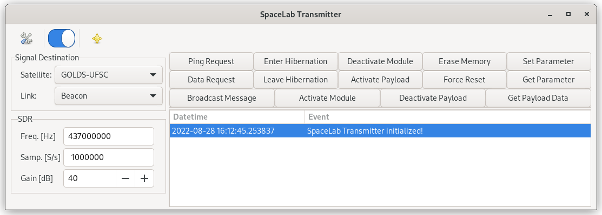
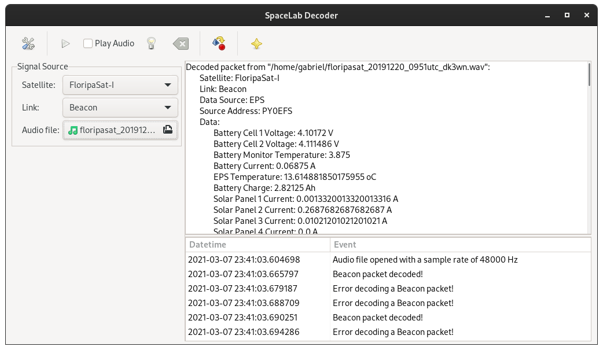

.. ground_segment.rst

    Copyright The Catarina-A1 Contributors.

    Catarina-A1 Documentation

    This work is licensed under the Creative Commons Attribution-ShareAlike 4.0
    International License. To view a copy of this license,
    visit http://creativecommons.org/licenses/by-sa/4.0/.

.. _ch:ground-segment:

**************
Ground Segment
**************

This chapter describes the Ground Segment of the mission. It is composed of two ground stations (one at the INPE-RN installations and the other at the SpaceLab installations) and one data collection platform (DCP, or *Plataforma de Coleta de Dados*) installed in Santa Catarina state.

The control of the mission and the reception of the collected data will be performed mainly at these two ground stations, but if necessary, other stations can execute this task.

UFSC Ground Station
===================

The UFSC ground station is currently being developed and prepared to be used for several missions developed by UFSC. This section presents the project of this station. A general block diagram can be seen in :numref:`fig:grs-block-diagram`.

.. figure:: figures/grs-block-diagram.*
   :name: fig:grs-block-diagram
   :width: 100%
   :align: center
   :alt: Block diagram of the Ground Segment at the UFSC ground station.

   Block diagram of the Ground Segment (UFSC ground station).

In the following sections, a description of the main components of the station will be presented.

Hardware
--------

This part describes the hardware side of the UFSC ground station and details the main peripherals that will be used in this project. Most of the components described here are represented in :numref:`fig:grs-block-diagram`.

Antennas
~~~~~~~~

There are two antennas in the ground station: one for VHF and one for the UHF band. The main characteristics of these antennas can be seen in :numref:`tab:grs-antennas`.

.. list-table:: Main characteristics of the Ground Segment antennas.
   :name: tab:grs-antennas
   :header-rows: 1
   :widths: 28 24 24 12
   :align: center

   * - **Characteristic**
     - **VHF Antenna**
     - **UHF Antenna**
     - **Unit**
   * - Brand
     - M\ :sup:`2`
     - Cushcraft
     - -
   * - Model
     - 2MCP14
     - A719B
     - -
   * - Type
     - Yagi
     - Yagi
     - -
   * - Number of elements
     - 14
     - 19
     - -
   * - Frequency range
     - 143–148
     - 430–450
     - MHz
   * - Gain
     - 12.34
     - 15.5
     - dBi
   * - Power rating
     - 1500
     - 2000
     - W
   * - Boom length
     - 3.2
     - 4.1
     - m
   * - Longest element
     - 1.02
     - 0.34
     - m
   * - Weight
     - 2.72
     - 2.55
     - kg

More information about the VHF and UHF antennas can be found in :cite:`2mcp14,a719b`, respectively.

Surge Protector
^^^^^^^^^^^^^^^

Two surge protectors will be used to protect the ground station electronics from possible atmospheric discharges in the outside components (one for each antenna). The gas surge protectors safely discharge or deflect up to 5000 A of peak current to earth without causing damage to an independent ground. This device is installed near the antennas, in cascade with the RF cables.

For this project, the MFJ-270N model will be used; a picture of it can be seen in :numref:`fig:mfj-270n`.

.. figure:: figures/mfj-270n.*
   :name: fig:mfj-270n
   :width: 40%
   :align: center
   :alt: MFJ-270N surge protector.

   MFJ-270N surge protector.

Rotators
~~~~~~~~

Both antennas (VHF and UHF) track the satellite through a two-axis rotator (azimuth and elevation). The model used is the Yaesu G-5500, which provides 450\ :math:`^{\circ}` azimuth and 180\ :math:`^{\circ}` elevation control of medium and large unidirectional satellite antenna arrays under remote control from the station operation position.

A picture of the G-5500 rotator (and controller) can be seen in :numref:`fig:g5500`; the main characteristics can be found in :numref:`tab:grs-rotor`.

.. figure:: figures/g5500.*
   :name: fig:g5500
   :width: 60%
   :align: center
   :alt: Yaesu G-5500 rotator and controller.

   Yaesu G-5500 rotator and controller.

.. list-table:: Main characteristics of the antennas' rotators.
   :name: tab:grs-rotor
   :header-rows: 1
   :widths: 56 25 19
   :align: center

   * - **Characteristic**
     - **Value**
     - **Unit**
   * - Brand
     - Yaesu
     - -
   * - Model
     - G-5500
     - -
   * - Voltage requirement
     - 110–120 or 200–240
     - :math:`V_{AC}`
   * - Motor voltage
     - 24
     - :math:`V_{AC}`
   * - Rotation time (elevation, :math:`180^{\circ}`)
     - 67
     - s
   * - Rotation time (azimuth, :math:`360^{\circ}`)
     - 58
     - s
   * - Maximum continuous operation
     - 5
     - min
   * - Rotation torque (elevation)
     - 14
     - kg-m
   * - Rotation torque (azimuth)
     - 6
     - kg-m
   * - Braking torque (elevation and azimuth)
     - 40
     - kg-m
   * - Vertical load
     - 200
     - kg
   * - Pointing accuracy
     - ±4
     - %
   * - Wind surface area
     - 1
     - :math:`m^2`
   * - Weight (rotator)
     - 9
     - kg
   * - Weight (controller)
     - 3
     - kg

More information about the ground station rotator can be found in :cite:`g5500`.

Amplifiers
~~~~~~~~~~

There are two dedicated amplifiers in the UFSC ground station: one power amplifier (PA) for transmitting telecommands with a high-power signal, and a low-noise amplifier (LNA) for amplifying the signals received from the satellite. Both are presented next.

Power Amplifier
^^^^^^^^^^^^^^^

The power amplifier is used to add gain to the signals generated by the transmitter. The model used is the Mini-Circuits ZHL-50W-52-S+ :cite:`zhl50w`. A picture of this power amplifier can be seen in :numref:`fig:zhl-50w`; the main characteristics are available in :numref:`tab:zhl-50w-specs`.

.. figure:: figures/zhl-50w.*
   :name: fig:zhl-50w
   :width: 30%
   :align: center
   :alt: Mini-Circuits ZHL-50W-52-S+ power amplifier.

   Mini-Circuits ZHL-50W-52-S+ power amplifier.

.. list-table:: Main characteristics of the ZHL-50W-52-S+ power amplifier.
   :name: tab:zhl-50w-specs
   :header-rows: 1
   :widths: 50 30 20
   :align: center

   * - **Characteristic**
     - **Value**
     - **Unit**
   * - Brand
     - Mini-Circuits
     - -
   * - Model
     - ZHL-50W-52-S+
     - -
   * - Frequency range
     - 50–500
     - MHz
   * - Gain
     - 47–52
     - dB
   * - Noise figure
     - 4.5–7.0
     - dB
   * - DC supply voltage
     - 24–25
     - V
   * - Maximum supply current
     - 9.3
     - A

Low-Noise Amplifiers
^^^^^^^^^^^^^^^^^^^^

The ZFL-500LN+ model from Mini-Circuits :cite:`zfl500ln` is used as the LNA. This amplifier will be used immediately after the antennas to add gain to incoming telemetry signals transmitted by the satellite. A picture of the low-noise amplifier can be seen in :numref:`fig:lna`; the main characteristics are available in :numref:`tab:lna-specs`.

.. figure:: figures/lna.*
   :name: fig:lna
   :width: 42%
   :align: center
   :alt: Mini-Circuits ZFL-500LN+ low-noise amplifier.

   Mini-Circuits ZFL-500LN+ low-noise amplifier.

.. list-table:: Main characteristics of the ZFL-500LN+ low-noise amplifier.
   :name: tab:lna-specs
   :header-rows: 1
   :widths: 50 30 20
   :align: center

   * - **Characteristic**
     - **Value**
     - **Unit**
   * - Brand
     - Mini-Circuits
     - -
   * - Model
     - ZFL-500LN+
     - -
   * - Frequency range
     - 0.1–500
     - MHz
   * - Gain
     - 24–28
     - dB
   * - DC supply voltage
     - 15
     - V
   * - Maximum supply current
     - 60
     - mA

Radios
~~~~~~

Besides the SDR solution presented in :numref:`fig:grs-block-diagram`, there is also an amateur radio transceiver with a standalone solution for the amateur radio link with the satellite. The model used is the Icom IC-9700 :cite:`ic9700`, an RF direct-sampling receiver for 2 m and 70 cm. The IF receiver consists of a single down-conversion for 23 cm, between 311 and 371 MHz. The PA provides 100 W on 2 m, 75 W on 70 cm, and 10 W on 23 cm.

In addition to band-specific memory channels, the IC-9700 allows band-specific receiver and transmitter settings. For transmission, users can adjust RF power, TX power limit, limit power, and TX delay by band. Basic receiver settings, such as the noise blanker and noise reduction, can be tweaked by band with a dynamic notch and filter setup by band and mode. A picture of the IC-9700 radio can be seen in :numref:`fig:ic9700`.

.. figure:: figures/ic-9700.*
   :name: fig:ic9700
   :width: 70%
   :align: center
   :alt: Icom IC-9700 radio transceiver.

   Icom IC-9700 radio transceiver.

Software Defined Radio
^^^^^^^^^^^^^^^^^^^^^^

As presented in :numref:`fig:grs-block-diagram`, the Ground Segment also has an SDR as a transceiver. The model used is the USRP B210, from Ettus Research :cite:`b210`, a fully integrated, single-board SDR with continuous frequency coverage from 70 MHz to 6 GHz. It combines the AD9361 RFIC direct-conversion transceiver, providing up to 56 MHz of real-time bandwidth, an open and reprogrammable Spartan-6 FPGA, and USB 3.0 connectivity. Full support for the USRP Hardware Driver (UHD) software also allows the use of the GNU Radio framework. A picture of the USRP B210 SDR (with enclosure) can be seen in :numref:`fig:usrp-b210`.

.. figure:: figures/usrp-b210.*
   :name: fig:usrp-b210
   :width: 60%
   :align: center
   :alt: Ettus USRP B210 software-defined radio.

   Ettus USRP B210 SDR.

Processing and Control
~~~~~~~~~~~~~~~~~~~~~~

The ground station control room shall have two monitors and a dedicated computer alongside most of the previously presented hardware. It will work as a monitoring room with an uninterruptible power supply to protect the equipment from power-grid fluctuations.

The antennas and rotator will also be monitored with outside cameras. The room will contain a server so that transmission and decoding can be done remotely and at any time.

:numref:`fig:server` shows the server used, and :numref:`tab:server` presents its main characteristics.

.. list-table:: Main characteristics of the Dell PowerEdge R240 server.
   :name: tab:server
   :header-rows: 1
   :widths: 35 65
   :align: center

   * - **Characteristic**
     - **Value**
   * - Brand
     - Dell
   * - Model
     - PowerEdge R240
   * - Processor
     - Intel Xeon E-2244G 3.8 GHz 4C/8T
   * - RAM memory
     - 16 GB DDR4 ECC
   * - Storage
     - 1 TB HD

.. figure:: figures/server.*
   :name: fig:server
   :width: 63%
   :align: center
   :alt: Dell PowerEdge R240 server.

   Dell PowerEdge R240 server.

Satellite Tracking
------------------

To track the satellite and for orbit prediction, the GPredict software :cite:`gpredict` will be used. GPredict is a real-time satellite-tracking and orbit-prediction application. It can track many satellites and display their position and other data in lists, tables, maps, and polar plots (radar view). GPredict can also predict the time of future passes for a satellite and provide detailed information about each pass. GPredict is free software licensed under the GNU General Public License. A picture of the main window of GPredict can be seen in :numref:`fig:gpredict`.

.. figure:: figures/gpredict.*
   :name: fig:gpredict
   :width: 100%
   :align: center
   :alt: Main window of GPredict.

   Main window of GPredict.

Packet Transmission
-------------------

Packet generation and transmission to the Catarina-A1 satellite can be done with the SpaceLab-Transmitter software :cite:`spacelab-transmitter`, which was written in Python with its interface developed using the GTK framework. It has a USRP handler made with Ettus libraries to work with the Ettus USRP B210, as shown in :numref:`fig:usrp-b210`. The supported modulation is Gaussian minimum shift keying (GMSK). Furthermore, the software has unit tests for the main modules and a logging system to record events, such as initialization or a successfully transmitted telecommand.

:numref:`fig:transmitter-tree` shows the product tree of the software, which contains its main elements, and :numref:`fig:spacelab-transmitter` shows its main window.

.. figure:: figures/transmitter_tree.*
   :name: fig:transmitter-tree
   :width: 60%
   :align: center
   :alt: SpaceLab-Transmitter product tree.

   SpaceLab-Transmitter product tree.

   Main window of the SpaceLab-Transmitter application.

Packet Decoding
---------------

The packet decoding of Catarina-A1 telemetry can be done using the SpaceLab-Decoder software :cite:`spacelab-decoder`, using a WAV file or through real-time reception. The decoded telemetry will appear in a dialog within the main window. The software was written in Python, and its interface was developed using the GTK framework. Furthermore, the software has unit tests for the main modules and a logging system to record events.

:numref:`fig:decoder-tree` shows the product tree of the software, which contains its main elements, and :numref:`fig:spacelab-decoder` shows its main window.

.. figure:: figures/decoder_tree.*
   :name: fig:decoder-tree
   :width: 60%
   :align: center
   :alt: SpaceLab-Decoder product tree.

   SpaceLab-Decoder product tree.

   Main window of the SpaceLab-Decoder application.

EMMN Ground Station
===================

The EMMN (*Estação Multimissão de Natal*, in Portuguese) ground station :cite:`emmn` was designed to operate in VHF, UHF, and S-Band frequency bands, receiving payload and telemetry data and transmitting telecommands from and to satellites operating in low orbits.

The station's radio-frequency systems use software-defined radios (SDRs), which offer the flexibility to quickly reconfigure parameters such as modulation type, encoding, and data rate. Most commonly used modulation schemes and encoding methods are already implemented, and customization can be requested.

The station performs autonomous tracking of several satellites according to a previous schedule and a scale of priorities. A client-server network design allows station users to send and receive data remotely.

A general block diagram of the EMMN hardware is available in :numref:`fig:emmn-bd`.

.. figure:: figures/emmn-bd.*
   :name: fig:emmn-bd
   :width: 100%
   :align: center
   :alt: General block diagram of the EMMN.

   General block diagram of the EMMN.

.. list-table:: EMMN specifications.
   :name: tab:emmn-info
   :header-rows: 1
   :widths: 30 70
   :align: center

   * - **Parameter**
     - **Value**
   * - Grid locator
     - HI24JD59CI
   * - Coordinates
     - -5.835238, -35.209285
   * - Altitude
     - 51 m
   * - Antennas
     - Yagi and parabolic
   * - Bands
     - VHF, UHF, and S-Band
   * - Frequencies
     - 144–146 MHz (VHF), 395–405 and 432–440 MHz (UHF), 2200–3300 MHz (S-Band)

.. figure:: figures/inpe-emmn.*
   :name: fig:emmn
   :width: 100%
   :align: center
   :alt: Multimission station of Natal, Rio Grande do Norte.

   Multimission station of Natal-RN.

Data Collection Platforms
=========================

Data Collection Platforms (DCPs) are part of the Integrated System of Environmental Data (*Sistema Integrado de Dados Ambientais*, SINDA, in Portuguese) :cite:`sinda`. The system collects data that satellites retransmit for reception at the ground station, after which it is sent to SINDA for processing. The data is shown online some time after reception. Examples of DCPs are shown in :numref:`fig:dcp_examples`.

.. subfigure:: AB|CC
    :name: fig:dcp_examples
    :gap: 8px
    :subcaptions: below
    :class-grid: outline
    :align: center

    .. image:: figures/pcd-1.jpg
        :width: 100%
        :align: center
        :alt: Example 1.

    .. image:: figures/pcd-2.jpg
        :width: 100%
        :align: center
        :alt: Example 2.

    .. image:: figures/pcd-3.jpg
        :width: 53%
        :align: center
        :alt: Example 3.

    Example of a data collection platform (DCP).
