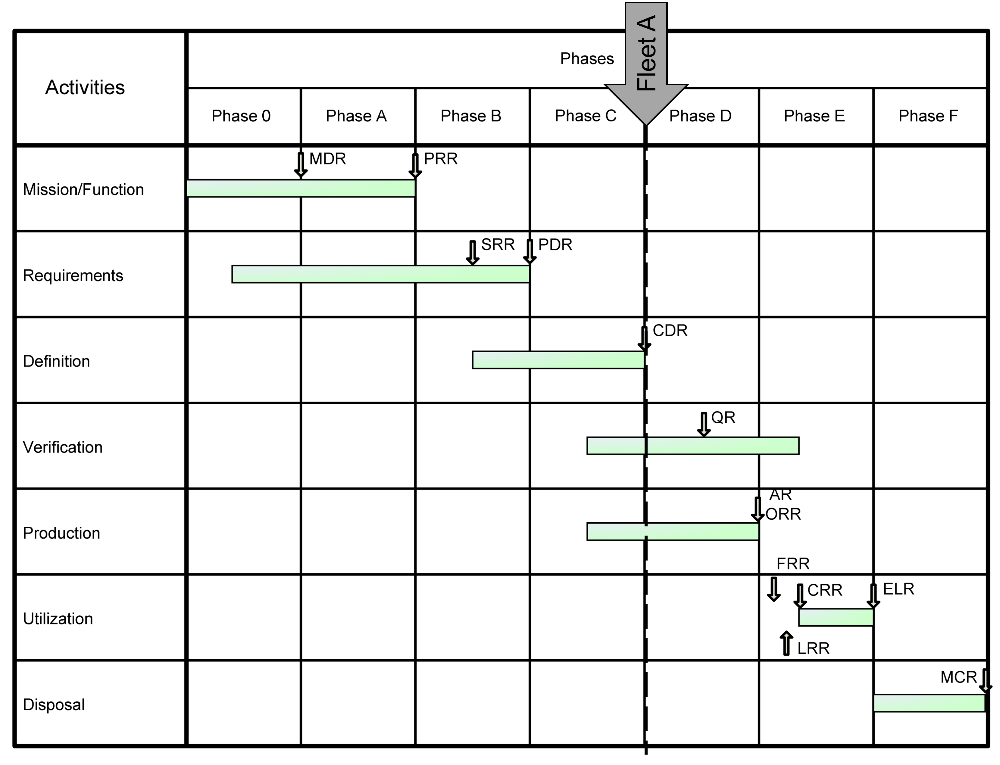
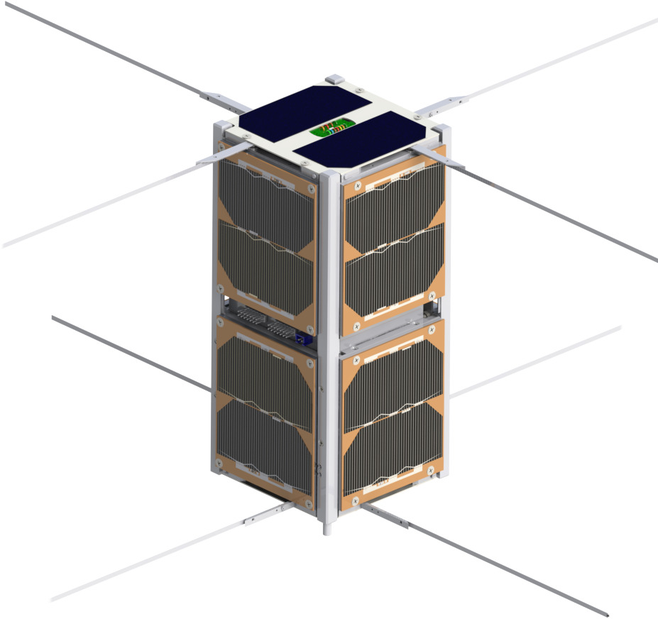
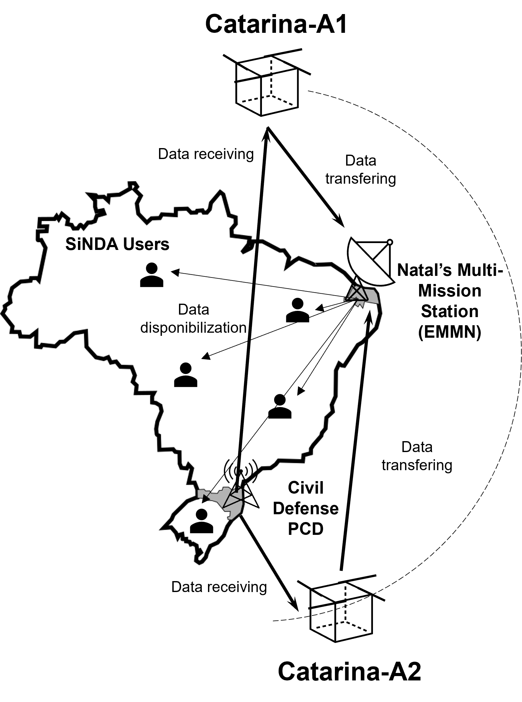
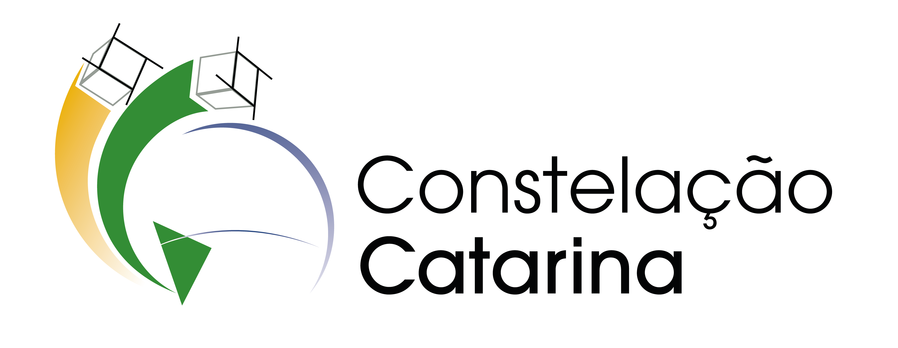

.. introduction.rst

    Copyright The Catarina-A1 Contributors.

    Catarina-A1 Documentation

    This work is licensed under the Creative Commons Attribution-ShareAlike 4.0
    International License. To view a copy of this license,
    visit http://creativecommons.org/licenses/by-sa/4.0/.

************
Introduction
************

The Catarina Constellation's Fleet A project adheres to the ECSS-E-ST-10C, a standard that specifies the system engineering implementation for the development of space systems and space products :cite:`ECSS-E-ST-10C`. Both space systems within the project, namely Catarina-A1 and Catarina-A2, follow the standard's prescribed life cycle model. The culmination of phase C of the project is marked by the :term:`CDR` event, depicted in :numref:`fig:life_cycle`. This event signifies the project's maturity and the incorporation of initial engineering concepts, rooted in the system and technical requirements defined up to this point.

.. _fig:life_cycle:

   Project life cycle. Adapted from :cite:`ECSS-E-ST-10C`.

The purpose of :term:`CDR` is to relate the product's technical requirements to the engineering solutions proposed by the design team. Thus, the objective of this documentation (as well as updating the data presented in previous reviews) is to present: information to confirm compatibility with the external interfaces, the final design of the space system and Ground Segment, the final AIV plan, and the verification of the space system and Ground Segment requirements state of verification. The conceptual design of the Catarina-A1's nanosatellite, the main object of this review, can be seen in :numref:`fig:cat-a1-render`.

.. information confirming compatibility with external interfaces, the final design of both the space system and Ground Segment, the final AIV plan, and the state of verification for the space system and Ground Segment requirements.

.. _fig:cat-a1-render:

   Catarina-A1 3D renderization.

Mission description
===================

About the Catarina Constellation
********************************

Catarina Constellation is a nanosatellite-based constellation focused on encouraging technological development in the space sector in Brazil and its application in several fields to contribute to society. Created through Ordinance n. 590, of May 6, 2021 \cite{Ordinance}, published by :term:`AEB`, the constellation is divided into fleets, each with a different mission, outlined from the survey of the needs among the stakeholders of each fleet. At least three fleets are initially estimated, and their missions are indicated below:

* **Fleet A**: Environmental data collection;
* **Fleet B**: Imaging;
* **Fleet C**: Radio occultation.

The constellation idea is changeable so that fleets have as many nanosatellites as needed in their configuration. For Fleet A, :term:`UFSC` and :term:`ISI-SE` enter as suppliers of space systems, assuming the roles of representatives of academia and industry in Santa Catarina, respectively, forming the triple helix of industry, academia, and government.

The :term:`UFSC` has experience with nanosatellite missions such as FloripaSat-1 and Serpens, while the :term:`ISI-SE` has experience with the VCUB mission. The union of academia and industry transforms knowledge, and academic research into economic activity, and promotes practical knowledge. With that, both institutions can help each other with the development of the CubeSats using their strengths, contributing to the training of human resources in space technology in the state.

Fleet A's Mission Declaration
*****************************

Approved in the event of :term:`MDR`, the mission statement for Fleet A of the Catarina Constellation is as follows:

    "*National services, such as Civil Defense and the agricultural sector, which use hydrometeorological data measured in loco, need the means to collect data from measurement platforms, preferably national, which stimulates the articulation of the triple helix of industry, academia, and government. In this way, the Catarina Constellation must promote the Brazilian space sector, with a focus on the industry of Santa Catarina, according to Ordinance n. 590, of May 6, 2021, published by the Brazilian Space Agency, which creates the Catarina Constellation Program and the Catarina Consortium.*

    *In this way, it is necessary to demonstrate the integration of data collection nanosatellites with existing systems, the Brazilian Data Collection System (SBCD) and the Integrated Environmental Data System (SINDA), with a measurement platform installed in the territory of the state of Santa Catarina. In the demonstration process, human resources should be trained for the following fleets of the Catarina Constellation program*" :cite:`MDR`.

Fleet A's Mission Definition
****************************

The mission of Fleet A of the Catarina Constellation consists of launching two CubeSats as technological demonstrators for data collection and transmission. Catarina-A1 will be a 2U CubeSat designed by the team at :term:`UFSC`, while Catarina-A2 will be designed as a 3U CubeSat by :term:`ISI-SE`.

The :numref:`fig:arq_FleetA` shows the official functional architecture of Fleet A. Its concepts of operation and further details on how the mission works can be found in :numref:`ch:conops`.

.. _fig:arq_FleetA:

   Fleet A's functional architecture :cite:`MDR`.

The satellites must pass through Santa Catarina, capture data from a :term:`DCP` based in Florianópolis and relay such data to :term:`EMMN`, which in turn will add this data packet to :term:`SINDA`, which will be available to all registered users. In this way, Fleet A will aggregate to :term:`SBCD`.

For the development of the mission, one of the needs raised was the preference for national technology. For this reason, the main payload of the two space systems will be the :term:`EDC`, developed by the :term:`INPE`.

As a technological demonstrator, Fleet A works at the same time as a case study of both the functioning of the nanosatellite-based constellation and the data collection with national technology, adding to the :term:`EDC` flight inheritance.

Mission objectives
******************

The :numref:`tab:goals-objectives` describes the goals and objectives related to the Catarina Constellation's Fleet A mission.

.. _tab:goals-objectives:

.. list-table:: Goals and objectives of the Catarina Constellation's Fleet A mission.
   :name: tab:goals-objectives
   :header-rows: 1
   :widths: 8 35 8 49

   * - **ID**
     - **Goal**
     - **ID**
     - **Objective**
   * - G.1
     - Collect data with national systems
     - O.1.1
     - Collect data from a platform provided by the Civil Defense and adapted by the national industry
   * - 
     - 
     - O.1.2
     - Route data through systems developed/adapted by the national industry, which allows the satellite data link between platforms and data distribution centers
   * - 
     - 
     - O.1.3
     - Use a nanosatellite platform to perform the satellite link
   * - G.2
     - Distribute data across legacy systems
     - O.2.1
     - Integrate the data with the SBCD
   * - 
     - 
     - O.2.2
     - Perform data distribution using SINDA
   * - G.3
     - Empower future fleets
     - O.3.1
     - Using ECSS as a basis for Space Systems Engineering

.. _sec:project_members:

Project members
===============

The project involves students, professors, and researchers from :term:`UFSC` and :term:`INPE`. Additionally, the team responsible for conducting the activities of this phase within the Catarina Constellation's Fleet A comprised the members described in :numref:`tab:members`.

.. _tab:members:

.. list-table:: Project members of the Catarina Constellation's Fleet A (2024/03/18).
   :name: tab:members
   :header-rows: 1
   :widths: 20 35 15 30

   * - Name
     - Contribution
     - Institution
     - Position
   * - **Mission**
     - 
     - 
     - 
   * - Talita Sauter Possamai
     - Mission and risk management
     - UFSC
     - Professor
   * - Damylle Cristina Xavier Donati
     - Systems engineering
     - UFSC
     - Doctoral student
   * - Augusto Marasca de Conto
     - Risks management
     - ISI-SE
     - Manager
   * - Rodrigo da Silva Cardozo
     - Orbit analysis
     - UFSC
     - Master student
   * - Monike Corleone
     - Administration
     - SC2C.Aero
     - Employee
   * - **Catarina-A1 Space System**
     - 
     - 
     - 
   * - Talita Sauter Possamai
     - Project management
     - UFSC
     - Professor
   * - Eduardo Augusto Bezerra
     - Technical management
     - UFSC
     - Professor
   * - Xisto Lucas Travassos
     - Frequency license coordination
     - UFSC
     - Professor
   * - Laio Oriel Seman
     - Technical management
     - UFSC
     - Professor
   * - Kleber Vieira de Paiva
     - Testing
     - UFSC
     - Professor
   * - Manoel Jozeane Mafra de Carvalho
     - Payload
     - INPE
     - Researcher
   * - Damylle Cristina Xavier Donati
     - Systems engineering
     - UFSC
     - Doctoral student
   * - Ludmila Kopko
     - Systems engineering
     - UFSC
     - Student
   * - Rodrigo da Silva Cardozo
     - Thermal experimental analysis
     - UFSC
     - Master student
   * - Gabriel Mariano Marcelino
     - Technical development
     - UFSC
     - Researcher
   * - João Cláudio Elsen Barcellos
     - EPS
     - UFSC
     - Master student
   * - Caique Sales de Miranda Gomes
     - Mechanical subsystem
     - UFSC
     - Student
   * - Ramon de Araujo Borba
     - EPS
     - UFSC
     - Student
   * - Vitória Beatriz Bianchin
     - Groundstation/Payload
     - UFSC
     - Student
   * - Miguel Boing
     - TTC
     - UFSC
     - Student
   * - Carlos Porto
     - OBDH
     - UFSC
     - Student
   * - Gabriel Cabral Marcílio
     - Scientific divulgation
     - UFSC
     - Student
   * - Maria Eduarda Rezende
     - Mechanical subsystem
     - UFSC
     - Student
   * - Matheus Wagner
     - ACS
     - UFSC
     - Student
   * - Rebecca Quintino do O
     - Systems engineering/Testing
     - UFSC
     - Student
   * - Sheila Costa
     - Procurement
     - UFSC
     - Student
   * - **EMMN Ground System**
     - 
     - 
     - 
   * - Marcos Aurelio Ferreira Dos Santos
     - Coordination
     - INPE-COENE
     - Researcher

Most of the modules and methods used in this project are based on past works, mainly the FloripaSat-1 and the :term:`EDC` projects. The list of the indirectly involved people is much bigger but not indicated in this document.

Mission patch
=============

The mission patch of the Catarina Constellation can be seen in \autoref{fig:mission-patch}.

.. _fig:mission-patch:

   Catarina Constellation mission patch.
