.. management.rst

    Copyright The Catarina-A1 Contributors.

    Catarina-A1 Documentation

    This work is licensed under the Creative Commons Attribution-ShareAlike 4.0
    International License. To view a copy of this license,
    visit http://creativecommons.org/licenses/by-sa/4.0/.

******************
Mission management
******************

This chapter presents the general management of the mission. The items presented in this section are: schedule for the space system Catarina-A1; cost estimation for the space system Catarina-A1; product tree for the mission and the space system Catarina-A1; risk management for the mission and the space system Catarina-A1, WBS for the space system Catarina-A1 and information about the launch.

.. _sec:schedule:

Schedule
========

This section comprises the updated schedule control of the Catarina-A1 space system.

Schedule definition
*******************

:numref:`fig:gantt-mdr` illustrates the mission schedule at this date. The schedule has been continuously updated since its first draft presented at the Mission Design Review (:term:`MDR`) :cite:`MDR`.

Since the technical development teams are not entirely identical for both space systems, only the management team, there are date differences for reviews regarding the design, integration, and testing of each space system. The present general schedule is related to the deliverables from the space system Catarina-A1, the object of this revision.

.. _fig:gantt-mdr:

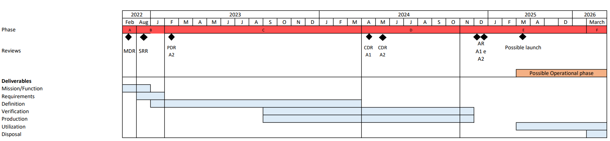

   Catarina-A1 space system's schedule.

The launch is currently scheduled for March 2025. More information on the potential launch can be found in :ref:`sec:launch`.

.. _sec:schedule_control:

Schedule control
****************

.. adicionar uma seção com compras realizadsa (paineis solares, tabela com items comprados e os não comprados - checar com SL o que dos sistemas de flight model já foram comprados) - adicionar status do processo da licença da frequencia - adicionar seção de subsystem status?

:numref:`fig:gantt-srr-dependencies-critical` shows the dependency diagram for critical packages. The red arrows indicate the critical path, which corresponds to the group of dependent items that present greater criticality for the project since they do not allow for much margin for scheduling flexibility.

.. _fig:gantt-srr-dependencies-critical:

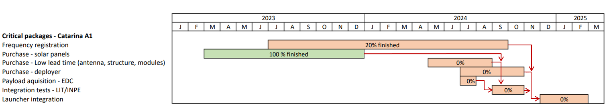

   Dependency diagram and critical path for Catarina-A1's.

As can be seen, four sets of packages generate criticality at the current stage of the project: the frequency license coordination, the acquisition/purchase of critical items for the space system, the acquisition/purchase of the deployer, and the :term:`AIT` tests at LIT/INPE.

Frequency license coordination, as estimated by ANATEL, typically takes between 8 and 12 months to complete. This process must be finalized before launcher integration can commence, expected by December 2024. For the Catarina-A1 space system, frequency license coordination began in July 2023 and is currently ongoing, with an anticipated completion date in September 2024.

The acquisition or purchase of critical items, such as antennas, structures, and modules, with low lead times (ranging from 4 to 12 weeks) along with the acquisition of the payload :term:`EDC`, significantly influences the initiation of :term:`AIT` tests at INPE. To allow for a 2-month window for potential date reservation with LIT/INPE, all items for the flight model must be on-site at Florianópolis - SC by the beginning of September 2024. To achieve this, the procurement process for these items must commence no later than May or June 2024. Regarding the :term:`EDC`, it must be available at Florianópolis - SC until July 2024.

The acquisition of the deployer together with the realization of :term:`AIT` tests is necessary for the start of the launcher integration, 90 days before the launch, at December 2024. The launch is estimated not before March 2025. More information about the launch can be found at :ref:`sec:launch`. This leaves a window for the :term:`AIT` tests between September and November 2024. As for the acquisition of the deployer, the procurement process must be initiated before July 2024.

.. _sec:Procurement_status:

Procurement status
******************

:numref:`tabela_procurement_status` indicates the current status of the purchase of major items necessary to carry out the mission for the Catarina-A1 space system. Solar panels are already available at Florianópolis - SC for flight model integration. Other items listed are scheduled to initiate the procurement process in May 2024, except for the deployer which is scheduled to initiate its process at Juin or July 2024.

.. _tab:tabela_procurement_status:

.. list-table:: Procurement Status.
   :name: tabela_procurement_status
   :header-rows: 1
   :widths: 40 35 25

   * - **Item**
     - **Estimated Lead time - weeks**
     - **Status**
   * - Solar panel
     - 32 - 38
     - ready
   * - Antenna
     - 8 - 12
     - not initiated
   * - Structure
     - 4
     - not initiated
   * - EPS module
     - 4
     - not initiated
   * - ACS components
     - 4
     - not initiated
   * - OBDH module
     - 4
     - not initiated
   * - TTC module
     - 4
     - not initiated
   * - ExpLora Payload
     - 3
     - EM ready - FM not initiated
   * - Deployer
     - 12
     - not initiated

.. _sec:frequency license coordination:

Frequency license coordination 
******************************

:numref:`tabela_status_frequencia` indicates the current status of frequency license coordination for the Catarina-A1 space system. The process is currently in progress and is estimated to be complete by September 2024.

.. _tab:tabela_status_frequencia:

.. list-table:: Frequency license coordination status.
   :name: tabela_status_frequencia
   :header-rows: 1
   :widths: 60 40

   * - **Etapa**
     - **Status**
   * - Registration at SEI
     - Ready
   * - Login TIES
     - Ready
   * - Official request at ANATEL
     - in progress
   * - Qualification at UIT system
     - not initiated
   * - Software installation and API form complete
     - not initiated
   * - API publication
     - not initiated
   * - Final notification at UIT
     - not initiated

Cost estimation
===============

The concept of cost described here extends beyond financial resources to include human resources, infrastructure, and consumables.
This section introduces the :term:`CBS` for the Catarina-A1 project. It provides a visual breakdown of all project expenses divided into categories, enabling easy tracking of each category's expenditure. Additionally, it includes the :term:`CER`, which offers a projected estimate of these expenses throughout the project duration.

.. _sec:cbs:

Cost breakdown structure 
************************

The CBS defined for space system Catarina-A1 of Catarina Constellation is illustrated in :numref:`fig:cbs-a1`. In this CBS, references can be made to the organizational chart presented in :ref:`sec:project_members`.

The categories indicated are: Direct human resources, Internal infrastructure, Supplies and other direct costs, Sub-contracts, and Expenses not linked to production. Quantities such as margin and profit are not included in the CBS.

In :numref:`fig:cbs-a1`, the boxes highlighted in blue indicate that such categories may undergo subsequent break-ups and the yellow boxes indicate categories and subcategories that potentially include indirect costs.

.. _fig:cbs-a1:

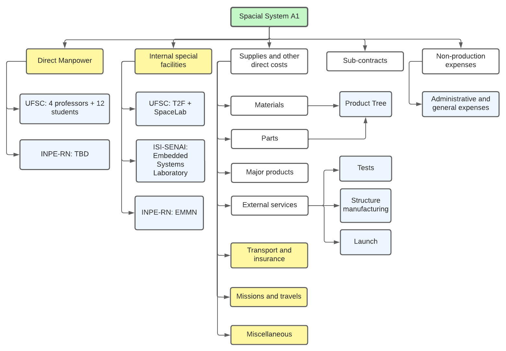

   Catarina-A1 System's Cost Breakdown Structure (:term:`CBS`).

The Human Resources category includes the official collaborators indicated in :ref:`sec:project_members` from the Federal University of Santa Catarina (:term:`UFSC`) and the team provided by the National Institute for Space Research in Natal (:term:`INPE-COENE`) for the mission, yet to be defined.

.. %acho que temos que trocar esse do INPE por gente nossa para operação

Regarding the internal facilities, references are made to: (*i*) the UFSC Spacelab laboratory that will be responsible for testing, manufacturing and integration of the Catarina-A1; (*ii*) the laboratories of the Thermal Fluid Flow Group (:term:`T2F`) that will be used to perform vibration and vacuum tests; (*iii*) to the ISI Embedded Systems laboratory that will be used for testing embedded systems; and (*iv*) to the infrastructure of the Estação Multi-Missão de Natal at INPE-RN that will assist in mission control.

In the category of supplies, the Product Tree itself stands out as a guide for costs with materials and parts (:numref:`fig:product-tree`), in addition to the testing and external purchases. Finally, as costs not linked to production, general and administrative expenses stand out.

.. _sec:cer:

Cost estimate report
********************

.. _sec:hypothesis-used:

Hypothesis used
...............

.. checar se as seções indicadas estão corretas

In the elaboration of the current version of this document, the following assumptions were used:

* **Economic conditions:** the budget for the Catarina Constellation - Fleet A project was already outlined at the time of prospecting with the financiers, and its allocation made by the Brazilian Space Agency (:term:`AEB`);
* **Currency:** the dollar/euro exchange rate is considered to be R$6.00;
* **Heritage/Technology Readiness Level:** see document of :term:`TRL`;
* **Design Status:** see Sections :ref:`sec:schedule` and :ref:`sec:wbs`;

.. _sec:cost_breakdown_tables:

Cost breakdown tables
.....................

To detail the categories shown in CBS (:ref:`sec:cbs`), the :term:`CBT` contains the estimated costs of each item mentioned above, taking into account the hypothesis presented in :ref:`sec:hypothesis-used`.

:numref:`tabela_cost1` lists the project costs as a whole, and :numref:`tabela_cost2` shows the Services category in detail. :numref:`tabela_cost3` shows the values of consumable items taken from the Product Tree of System Catarina-A1.

Operational costs are not accounted for due to the possibility of aggregating this cost into a future project. For clarification, the operational costs estimated are related only to human resources for 1 year responsible for the connection and download of data from the satellites during its passage over the EMMN.

.. _tab:tabela_cost1:

.. list-table:: Estimated costs to the project - Catarina-A1.
   :name: tabela_cost1
   :header-rows: 1
   :widths: 40 30 30

   * - **Category**
     - **Value [R$]**
     - **Percentage**
   * - Human Resources
     - 388.280,00
     - 22,8
   * - Consumables and capital
     - 781.592,00
     - 46,0
   * - Services
     - 215.184,88
     - 12,7
   * - Members transportation
     - 7.000,00
     - 0,4
   * - Daily Rates
     - 12.000,00
     - 0,7
   * - Administrative fees
     - 296.059,12
     - 17,4
   * - **Total**
     - **1.700.116,00**
     - **100**

.. _tab:tabela_cost2:

.. list-table:: Estimated costs to the project - Services - Catarina-A1.
   :name: tabela_cost2
   :header-rows: 1
   :widths: 40 30 30

   * - **Services**
     - **Available value [R$]**
     - **Value spent [R$]**
   * - AIT tests - LIT
     - 60.120,88
     - 0
   * - Secondary service costs
     - 38.000,00
     - 0
   * - Other (importation fees)
     - 117.064,00
     - 5.580

.. _tab:tabela_cost3:

.. list-table:: Estimated costs to the project - consumable items.
   :name: tabela_cost3
   :header-rows: 1
   :widths: 30 25 25 20

   * - **Material**
     - **Available value [R$]**
     - **cost estimative [R$]**
     - **value spent [R$]**
   * - Structure
     - 44.000,00
     - 44.000,00
     - 0
   * - Solar panel
     - 340.000,00
     - 340.000,00
     - 339.900
   * - Interface plates
     - 8.352,00
     - 8.352,00
     - 0
   * - Antenna module
     - 83.067,00
     - 60.000,00
     - 0
   * - OBDH EM
     - 24.000,00
     - 24.000,00
     - 0
   * - TTC EM
     - 32.000,00
     - 32.000,00
     - 0
   * - EPS EM
     - 28.000,00
     - 28.000,00
     - 0
   * - EM Battery module
     - 12.000,00
     - 12.000,00
     - 0
   * - Payload EM
     - 32.000,00
     - 32.000,00
     - 0
   * - OBDH FM
     - 36.000,00
     - 36.000,00
     - 0
   * - TTC FM
     - 44.000,00
     - 44.000,00
     - 0
   * - EPS FM
     - 40.000,00
     - 40.000,00
     - 0
   * - FM Battery module
     - 20.000,00
     - 20.000,00
     - 0
   * - Payload FM
     - 6.600,00
     - 6.600,00
     - 0
   * - Cables
     - 4.176,00
     - 4.176,00
     - 0
   * - Bolts, resins, etc
     - 4.176,00
     - 4.176,00
     - 0
   * - Others
     - 23.221,00
     - 23.221,00
     - 23.221,00
   * - Deployer
     - -
     - 180.000,00
     - 0

The secondary service cost herein accounts for the cost related to the preparation for launch (transportation of the space system and others related). The cost for the launch is not listed here since the probable launch for the space system Catarina-A1 will be a free-of-charge launch due to a collaboration with :term:`AEB`. More details can be found in the Launch section of this document.

Importation fees for international purchases are classified as Services cost - other. All items indicated in table :numref:`tabela_cost3` are purchased from suppliers from outside Brazil except for the solar panels, structure, and minor electronic items such as cables and others. Cost estimative for international purchased items in :numref:`tabela_cost3` do not take into account importation fees since all importation fees are applied to the service cost - others - importation fees presented in table :numref:`tabela_cost2`. Importation fees are estimated at 30 percent of the total value of the item.

The cost for a 3U deployer is also listed in table :numref:`tabela_cost3` although not initially considered in the project's main budget. Possibilities for extra budget or relocation of resources for this item are being considered at the current stage of the project.

It is highlighted here that no or minimum financial resources were spent on items for the Engineering Model (:term:`EM`). However, the :term:`EM` is in an advanced stage of completeness, as is described in later sections of this document. The explanation for this fact is that the space system Catarina-A1 is based on the same design as the space system GOLDS-UFSC, designed in parallel by the same technical team. The :term:`EM` used for the Catarina-A1 is then the same as the one applied to GOLDS-UFSC.

.. _sec:cost_sensitivity_analysis:

Cost sensitivity analysis
.........................

Referring to :ref:`sec:cbs` stand out the cost categories of:

* **External Services:** The launch is included in this category, and it has an extremely variable cost, depending on the launch location, the time of year, the number of items launched in the chosen launcher, and the economic and political conditions - both international and internal at the country where the launch will take place; However, negotiations of a free of charge launch based on a cooperation agreement between :term:`AEB` and a Launch provider company is currently being discussed.  Operational phase costs are also in this category and are not contemplated in the current budget.
* **Materials and Parts:** The variation of the dollar and the lack of components in the market generate insecurity regarding some specific components of the Product Tree and their respective parts. However, due to the use of the :term:`EM` from GOLDS-UFSC applied to the Catarina-A1, some resources initially reserved for the EM may be used to mitigate this possible extra cost.
* **Transport and Insurance:** Highly dependent on launch parameters, this category also suffers from the same restrictions as the first item. However, the possible launch is inside Brazilian territory, contributing to mitigating this possible extra cost.

Such categories generate risks linked to project cost and are indicated in :ref:`sec:risks`, related to risk assessments.

.. _sec:Recomendations:

Recomendations
..............

Specifically for the items described in :ref:`sec:cost_sensitivity_analysis`, it is recommended to relocate or increase a small amount of budget for the operational phase (human resources during the operational phase) and possibly extra cost due to the procurement of the deployer.

.. _sec:product-tree:

Product tree
============

:numref:`fig:PT_Geral` illustrates the Product Tree of the mission of Fleet A of Catarina Constellation. In it, the space system and ground system branches are present. Fleet A’s mission is managed from :term:`UFSC` and :term:`ISI-SE` and operated from :term:`EMMN` throughout the operational phase – Launch and Initial Orbit Phase and Routine Operation Phase – and shares existing resources (infrastructure, equipment, personnel, etc.) with other missions like Global Open Collecting Data System (GOLDS-UFSC).

Since the two space systems in the fleet are architecturally distinct, each has its own Product Tree.

.. _fig:PT_Geral:

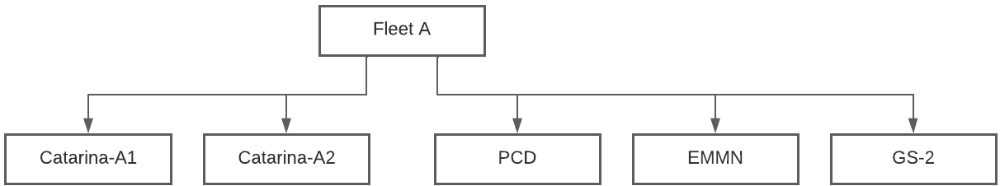

   Fleet A's Product Tree.

The product tree of the Catarina-A1 satellite is the project breakdown into successive levels of hardware and software products (or elements). The product tree of the project can be seen in the diagram of :numref:`fig:product-tree`. As shown, the satellite was divided into eight segments.

.. nesse figura precisamos atualizar que na parte de ground tem o INPE tb, nessa que está parece haver só o GS da UFSC

.. _fig:product-tree:

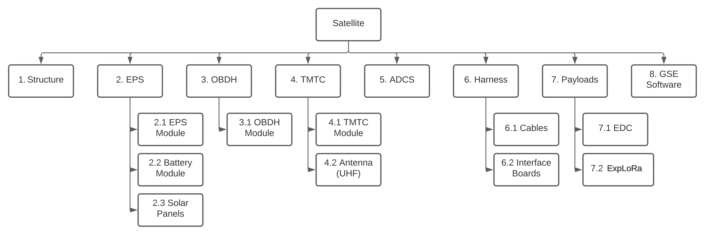

   Product tree diagram of the satellite.

The supplier of each element of the product tree is available in :numref:`tab:product-tree-sup`.

.. _tab:product-tree-sup:

.. list-table:: Suppliers of the product tree's elements.
   :header-rows: 1
   :widths: 50 50

   * - **Element**
     - **Supplier**
   * - Satellite
     - UFSC
   * - Mechanical Structure
     - Usiped
   * - EPS Hardware
     - SpaceLab
   * - EPS Firmware
     - SpaceLab
   * - Battery Module
     - SpaceLab
   * - Solar Panels
     - Orbital
   * - OBDH Hardware
     - SpaceLab
   * - TTC Hardware
     - SpaceLab
   * - TTC Firmware
     - SpaceLab
   * - Antenna
     - ISISpace
   * - ACS
     - SpaceLab
   * - Harness
     - SpaceLab
   * - Interface Boards
     - SpaceLab
   * - EDC
     - INPE-RN
   * - ExpLoRa
     - SpaceLab
   * - GSE Software
     - SpaceLab

.. The ID code, name, and supplier of each item, presented in Fig.~\ref{PT_A1}, are described in Table ~\ref{ID_Code}. The documentation for each item is presented in Table ~\ref{ID_Docs}.

.. Softwares at UFSC-CAT-A1-QAS-CIL-0001_A
.. Items listed as TBD in Tab.~\ref{ID_Docs} will be defined in subsequent versions, once the final architecture has been approved.

.. atualizar tabela abaixo

..
    \begin{table}[H] \footnotesize
    \centering
    \begin{tabular}{|p{2cm}|p{2cm}|c|c|c|p{3cm}|c|p{2cm}|}
    \hline
    \rowcolor[HTML]{BF9000}
    {\color[HTML]{FFFFFF} \textbf{Critical Function}} & {\color[HTML]{FFFFFF} \textbf{Element}} & {\color[HTML]{FFFFFF} \textbf{TRL \#}} & {\color[HTML]{FFFFFF} \textbf{TRA report}} & {\color[HTML]{FFFFFF} \textbf{TRA date}} & {\color[HTML]{FFFFFF} %\textbf{Rationale for TRL evaluation}} & {\color[HTML]{FFFFFF} \textbf{Target TRL}} & {\color[HTML]{FFFFFF} \textbf{CIL Candidate (Y/N)}} \\ \hline
    Data collection & Main Payload (\acs{EDC}) & 6 & Under testing & 7/19/2022 & No flight heritage. Present in other space missions & 9 & Y \\ \hline
    Data collection & Payload Z & 4 & Under testing & 7/19/2022 & In-house development. No flight heritage & 9 & Y \\ \hline
    \acs{OBDH} & OBDH hardware & 9 &  &  & In-house development. Has flight heritage & - & N \\ \hline
    OBDH & OBDH Software & 5 & Under testing & 7/19/2022 & In-house development. No flight heritage & 9 & Y \\ \hline
    \acs{TT-TC} & TT\&TC & 9 &  &  & In-house development. Has flight heritage & - & N \\ \hline
    Communication & Antenna & 9 &  &  & COTS & - & N \\ \hline
    Power supply & \acs{EPS} & 9 &  &  & In-house development. Has flight heritage & - & N \\ \hline
    Power supply & EPS Software & 5 & Under testing & 7/19/2022 & In-house development. %No flight heritage & 9 & Y \\ \hline
    Power supply & Battery & 9 &  &  & In-house development. Has flight heritage & - & N %\\ \hline
    Power supply & Solar Pannels & 9 &  &  & \acs{COTS} & - & N \\ \hline
    \acs{GSE} & GSE Software & 5 & Under testing & 7/19/2022 & In-house development. No %flight heritage & 9 & Y \\ \hline
    Attitude control & ACS & 5 & Under testing & 7/19/2022 & In-house development. No %flight heritage & 9 & Y \\ \hline
    Structural & Structure & 6 & To be purchased & 7/19/2022 & No flight heritage. %Present in other space missions & 9 & Y \\ \hline
    \end{tabular}
    \caption{Catarina-A1's \ac{TRL}}
    \label{trl}
    %\end{table}

.. _sec:wbs:

Work breakdown structure
========================

The Work Breakdown Structure (:term:`WBS`) is presented as a diagram in :numref:`fig:wbs`. The :term:`WBS` is divided into work packages (:term:`WP`) as can be seen in the diagram. The description of each :term:`WP` is detailed in :numref:`WPD-table`. In this table, the completed packages are highlighted in red and the ongoing packages are highlighted in blue.

.. _fig:wbs:

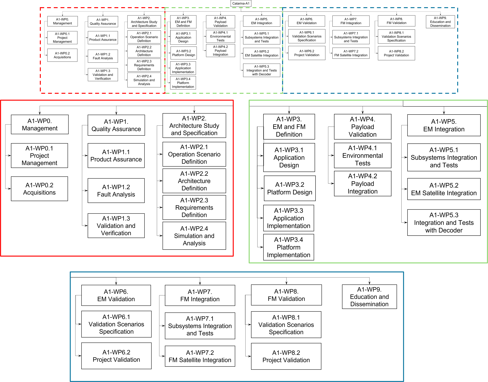

   Catarina-A1's WBS diagram.

.. _tab:WPD-table:

.. list-table:: Work packages definition.
   :name: WPD-table
   :header-rows: 1
   :widths: 35 35 30

   * - **Work Packages**
     - **Document Emission**
     - **Contributions**
   * - **A1-WP0 Management**
     - 
     - 
   * - A1-WP0.1 Project Management
     - Management plan; Schedule; WBS; Cost estimate report; Documentation templates
     - Product tree
   * - A1-WP0.2 Acquisitions
     - 
     - Cost estimate report; Schedule
   * - **A1-WP1 Quality Assurance**
     - 
     - 
   * - A1-WP1.1 Product Assurance
     - Product assurance plan
     - Fault Tree Analysis report; Critical items list
   * - A1-WP1.2 Fault Analysis
     - Fault Tree Analysis report; Critical items list
     - Product Assurance plan
   * - A1-WP1.3 Validation and Verification
     - Qualification status list; Logbook; Verification plan; Declared components list; Data sheet; Justification document
     - Fault Tree Analysis report; Critical items list; AIT Plan
   * - **A1-WP2 Architecture Study and Specification**
     - 
     - 
   * - A1-WP2.1 Operation Scenario Definition; A1-WP2.2 Architecture Definition; A1-WP2.3 Requirements Definition
     - Technical requirements; Design definition; Design justification; Technical budget; Requirement justification; Trade-off reports
     - Technological readiness level report
   * - A1-WP2.4 Simulation and Analysis
     - Space Debris analysis report
     - 
   * - A1-WP3 EM and FM Definition
     - 
     - 
   * - A1-WP3.1 Application Design
     - System enviromental specifications; System development plan; System specifications
     - 
   * - A1-WP3.2 Platform Design
     - 
     - 
   * - A1-WP3.3 Application Implementation
     - 
     - 
   * - A1-WP3.4 Platform Implementation
     - 
     - 
   * - **A1-WP4 Payload Validation**
     - 
     - 
   * - A1-WP4.1 Environmental Tests
     - System Test procedure; System Test report
     - Satellite V&V plan
   * - A1-WP4.2 Payload Integration
     - 
     - 
   * - **A1-WP5 EM Integration**
     - 
     - 
   * - A1-WP5.1 Subsystems Integration and Tests
     - System Test procedure; System Test report
     - 
   * - A1-WP5.2 EM Satellite Integration
     - 
     - 
   * - A1-WP5.3 Integration and Tests with Decoder
     - 
     - 
   * - **A1-WP6 EM Validation**
     - 
     - 
   * - A1-WP6.1 Validation Scenarios Specification
     - System V&V plan
     - Satellite V&V plan
   * - A1-WP6.2 Project Validation
     - 
     - 
   * - **A1-WP7 FM Integration**
     - 
     - 
   * - A1-WP7.1 Subsystems Integration and Tests
     - System Test procedure; System Test report
     - 
   * - A1-WP7.2 FM Satellite Integration
     - 
     - 
   * - **A1-WP8 FM Validation**
     - 
     - 
   * - A1-WP8.1 Validation Scenarios Specification
     - System V&V plan
     - Satellite V&V plan
   * - A1-WP8.2 Project Validation
     - 
     - 

Risk management
===============

A risk is an event that threatens the project's success, even if partially. Therefore, this plan aims to help identify adverse events at an early stage, handle them, and mitigate them. The development of this project will be based on a qualitative risk analysis standard. This depends on crossing two metrics: the probability of risk occurrence and the impact of risk occurrence.

.. _sec:risks:

Risks identification
********************

The identified risks are displayed below, classified by source (programmatic, technical, or extern), likelihood (Very Rare-Expected), and consequences (1-5). The trends from the last review to this one are also displayed. The risk :term:`ID` is related to the Fleet A of Catarina Constellation and also comprises risks belonging to the space system A2 and now closed risk, not addressed in this document.

A total of five risks are indicated as high, all identified as technical ones. They are related to the commissioning of the satellite and the development in-house of the :term:`EPS` and :term:`OBDH` systems. No risk worsened in the period between the :term:`SRR` and this :term:`CDR`, where some improved and most were unchanged.

..
    \begin{table}[H]
        \centering
        \begin{tabular}{lL{0.45\textwidth}ccc}
        \toprule[1.5pt]
        \textbf{ID} & \textbf{Risk} & \textbf{Context} & \textbf{Likelihood} & \textbf{Impact} \\
        \midrule
        RSK-1 & Unable to obtain additional financial resources to complete the mission & Mission & Improbable & 5 \\
        RSK-2 & Lack of components on the market & Mission & Probable & 2 \\
        RSK-3 & High turnover of the development team & Mission  & Improbable & 2 \\
        RSK-4 & Significant rise in the dollar (may not have enough resources to acquire systems) & Mission & Probable & 3 \\
        RSK-5 & Satellite commissioning failure & Mission & Improbable & 5 \\
        RSK-6 & Satellite does not survive launch & Mission & Rare & 5 \\
        RSK-7 & Ground Station failure & Mission & Improbable & 5 \\
        RSK-8 & LIT not available for satellite qualification tests & Mission  & Improbable & 2 \\
        RSK-9 & Operational licensing not available on launch time & Mission  & Improbable & 3 \\
        RSK-10 & EPS Software operation failure & System & Improbable & 5 \\
        RSK-11 & OBDH software operation failure & System & Improbable & 5 \\
        RSK-12 & Radiation instrument operation failure & System  & Improbable & 1 \\
        RSK-13 & GSE software operation failure & System  & Improbable & 4 \\
        RSK-14 & EDC does not comply with requirements & System & Rare & 4  \\
        RSK-15 & Materials resources not sufficient for preliminary tests & System & Probable & 2 %\\
        RSK-16 & Fail on vibration tests impacting on delays & System  & Rare & 3 \\
        RSK-17 & Non compliant metrological requirements impacting on delays & System & Probable & 2 \\
        RSK-18 & Kill switch mechanism fails, and satellite does not power on & System & Very rare & 5 \\
        RSK-19 & COTS systems not available in market & System & Rare & 3 \\
        \bottomrule[1.5pt]
        \end{tabular}
        \caption{Mission and space systems risks.}
        \label{risk_ID}
    \end{table}

.. atualizar riscos do A1 e missão - estão faltando vários e fazer o grafico de riscos classico e juntar todos lá

.. _fig:riscos_programaticos:

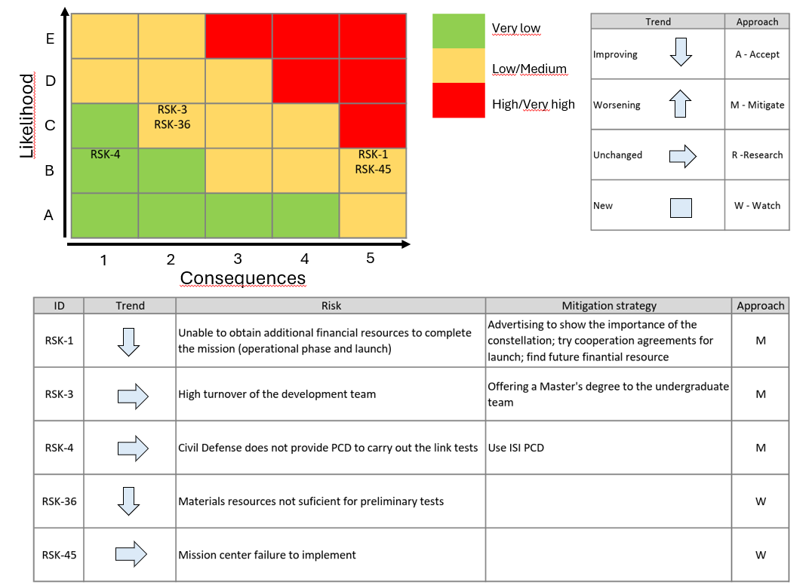

   Programatic risks - Catarina-A1.

.. _fig:riscos_tecnicos_grafico1:

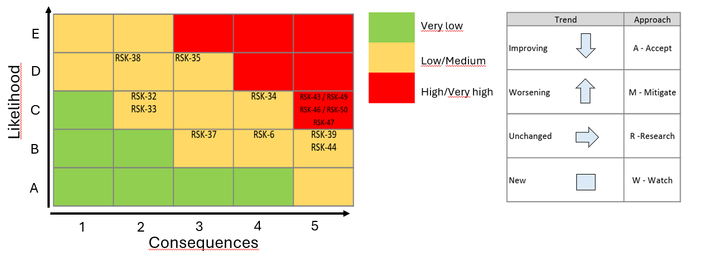

   Technical risks analysis - Catarina-A1.

.. _fig:riscos_tecnicos_tabela1:

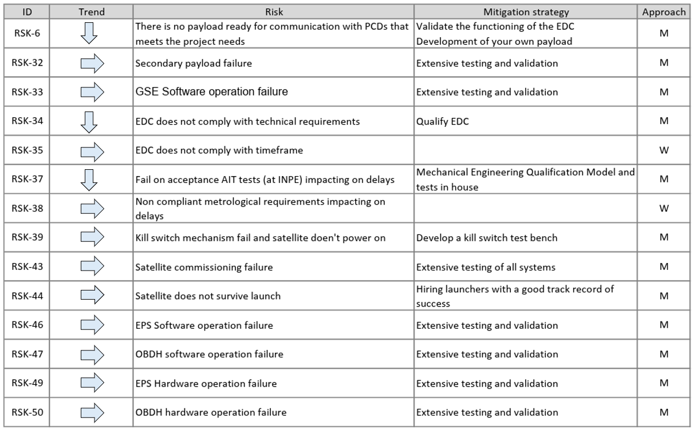

   Technical risks trends - Catarina-A1.

.. _fig:riscos_tecnicos_grafico2:

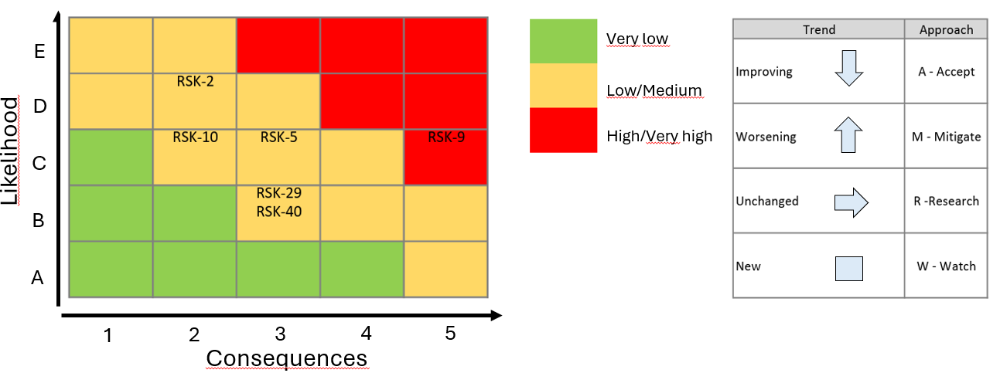

   External risks analysis - Catarina-A1.

.. _fig:riscos_tecnicos_tabela2:

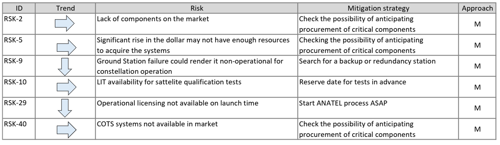

   External risks trends - Catarina-A1.

.. _sec:launch:

Launch
======

A cooperation agreement is being discussed between a private launcher company and :term:`AEB` to provide the launch of the Space System Catarina-A1 from Catarina Constellation. As indicated in :numref:`fig:gantt-mdr` the launch is scheduled for March 2025, from Alcântara Space Center - Brazil.

The cooperation agreement provides a payload of 15 kg for :term:`AEB` to be used for nanosatellites launch. The agreement does not include the CubeSat deployer and this cost was added to the current mission. Preliminary estimates indicate that for a 15 kg payload, it is possible to carry the space system Catarina-A1 (2U with 2.6 kg), the space system A2 (3U with 2.3 kg) and a third 2U space system with a total mass maximum of 2.6 kg. The other 7.5 kg accounts for three 3U deployer masses and two 1U dummies masses. Values for mass estimates are based on the ISIS 3U deployer. More details can be seen in :numref:`tab:tabela_mass_lancamento`.

Two possible launch orbits are being analyzed: :term:`SSO` orbit with 500 km altitude and a :math:`43^{\circ}` inclination orbit with 500 km altitude. Calculations for communication time and decay are presented in a later section.

.. _tab:tabela_mass_lancamento:

.. list-table:: Estimated mass and composition of the proposed launch.
   :header-rows: 1
   :widths: 45 30 25

   * - **Item**
     - **Estimated mass (kg)**
     - **Load**
   * - Deployer 3U
     - 2
     - A1 + dummy load
   * - Deployer 3U
     - 2
     - A2
   * - Deployer 3U
     - 2
     - CubeSat 2U + dummy load
   * - A1
     - 2.6 (max)
     - -
   * - A2
     - 2.3
     - -
   * - 2U
     - 2.6 (max)
     - -
   * - Dummy loads (2 units)
     - 1.5 (max - 0.75 each unit)
     - -
   * - **Total**
     - **15**
     - **-**
