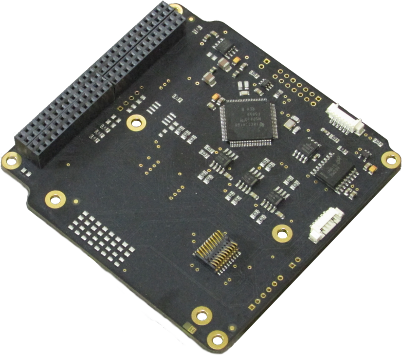
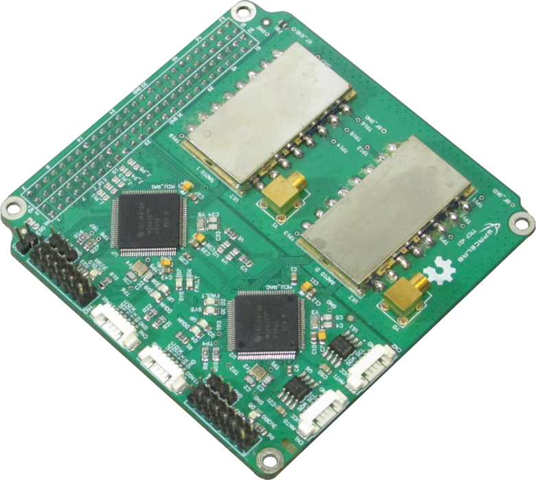
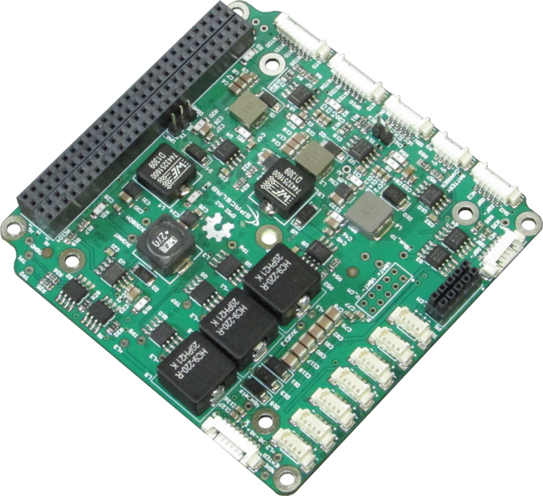
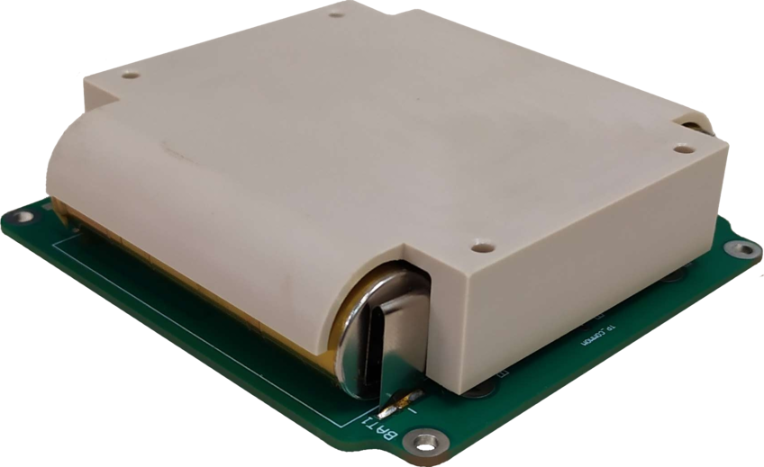
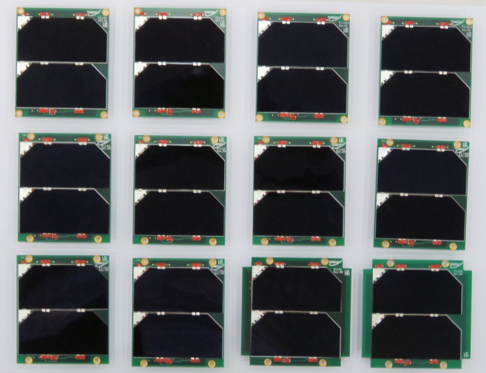
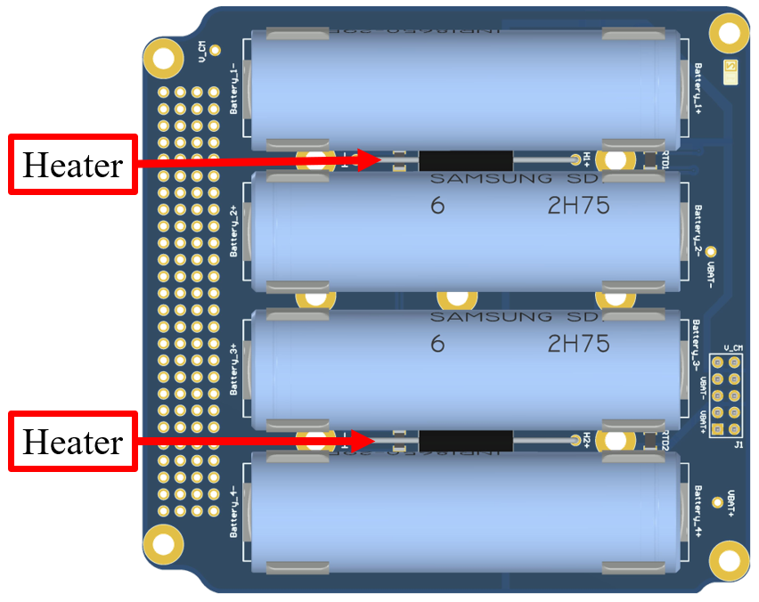
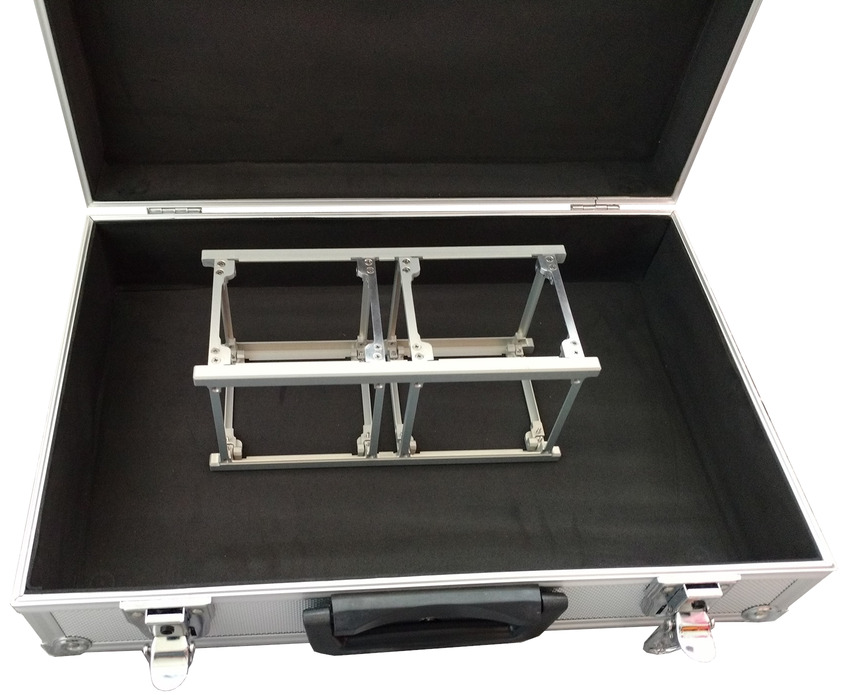
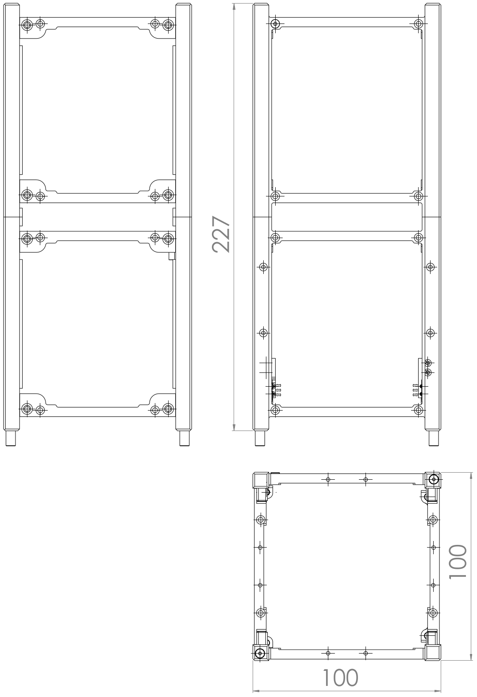
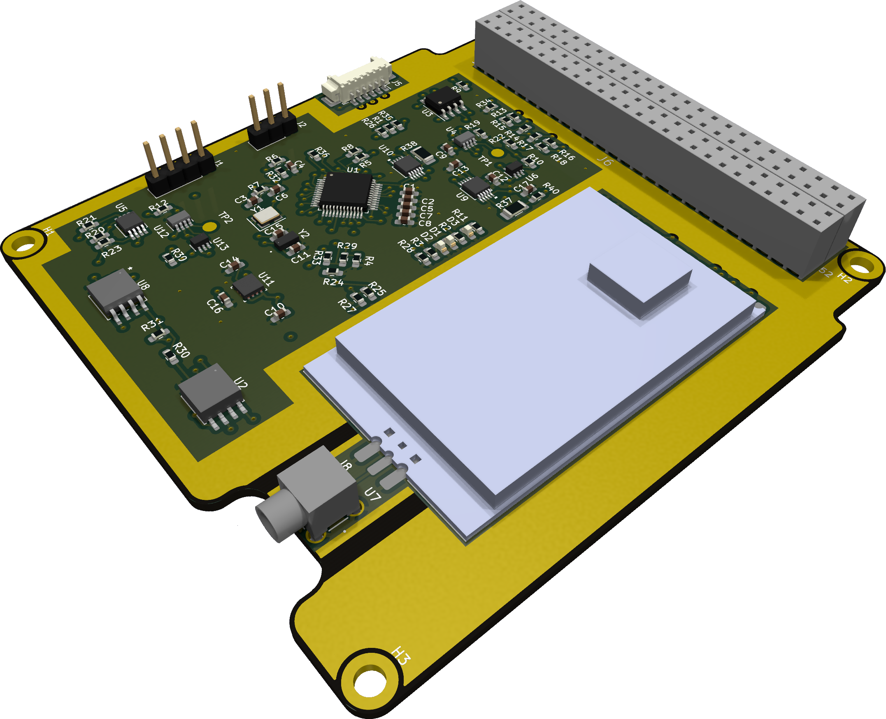

.. subsystems.rst

    Copyright The Catarina-A1 Contributors.

    Catarina-A1 Documentation

    This work is licensed under the Creative Commons Attribution-ShareAlike 4.0
    International License. To view a copy of this license,
    visit http://creativecommons.org/licenses/by-sa/4.0/.

**********
Subsystems
**********

This chapter describes all subsystems of the Space Segment of the mission. Most of the subsystems presented here have their own technical documentation with a more comprehensive description. When available, there is a reference to the respective document. The aim of this chapter is to provide a high-level view of each subsystem within the wider scope of the mission.

On-Boarding Data Handling
=========================

The :term:`OBDH` 2.0 is an :term:`OBC` module designed for nanosatellites. The module is responsible for synchronizing actions and the data flow between other modules (i.e., power module, communication module, payloads) and the Earth segment. It packs the generated data into data frames and transmits back to Earth through a communication module or stores it on non-volatile memory for later retrieval. Commands sent from Earth segment to CubeSat are received by radio transceivers in the communication module and redirected to the :term:`OBDH`, which takes the appropriate action or forwards the commands to the target module.

The module is a direct upgrade from the :term:`OBDH` of FloripaSat-1 :cite:`floripasat`, which grants a flight heritage rating. The improvements focus on providing a cleaner and more generic implementation than the previous version, more reliability in software and hardware implementations, and adaptations for the new mission requirements. The module board can be seen in :numref:`fig:obdh2`.

   :term:`OBDH` module.

More information about this module can be found in :cite:`obdh2`.

Telemetry, Tracking and Command Module
======================================

The :term:`TTC` (or TT\&C) is responsible for making the communication between Earth (a ground station) and the satellite and is divided into two sub-modules: Beacon and downlink/uplink. The beacon is an independent sub-module that transmits a periodic signal containing satellite :term:`ID` and some basic telemetry data. The downlink/uplink sub-module is the primary communication device. It has a bidirectional data link to receive telecommands from the Earth and transmit all available data back to Earth. The module board can be seen in :numref:`fig:ttc`. More information about this module can be found in :cite:`ttc`.

   :term:`TTC` module.

Antenna Module
**************

The antenna module used is the CubeSat deployable :term:`VHF` and :term:`UHF` antenna from ISISpace :cite:`isis-antenna`. It is a four-monopole antenna built with tape strings (up to 55 cm) and compliant with the CubeSat standard. It can be also configured as dipole or turnstile type antenna. The deployment method is the burn wire, which can be controlled digitally through a :math:`I^{2}C` interface. To allow redundancy, two independent deployment controllers can be activated separately. Furthermore, the construction of this module allows the installation of a solar panel on the top side. The RF gain is about 0 dBi. A picture of the antenna module (with all the antennas released) can be seen in :numref:`fig:isis-antenna`.

.. figure:: figures/isis-antenna.*
   :name: fig:isis-antenna
   :width: 80%
   :align: center
   :alt: Antenna module

   Antenna module from ISISpace.

For this mission, two antenna modules will be used. The chosen can be seen in :numref:`tab:antennae-config` (using :numref:`fig:isis-antenna-ref` as reference):

.. list-table:: Antennae configuration.
   :name: tab:antennae-config
   :header-rows: 1
   :widths: 40 30 30
   :align: center

   * - **Parameter**
     - **Antenna 1**
     - **Antenna 2**
   * - Configuration
     - Turnstile
     - Turnstile
   * - Frequency
     - 468 MHz
     - 401 MHz
   * - Tunning structure size
     - 2U
     - 2U
   * - Mounting position
     - Top
     - Bottom
   * - Supply voltage
     - 3.3 V
     - 3.3 V
   * - I2C control type
     - Dual bus
     - Dual bus
   * - I2C watchdog
     - Enabled (60 sec timeout)
     - Enabled (60 sec timeout)

.. figure:: figures/isis-antenna-ref.*
   :name: fig:isis-antenna-ref
   :width: 70%
   :align: center
   :alt: Antenna configuration

   Configuration reference of the antenna module.

A temperature sensor and the state of four deployment switches (1 per monopole) are also available in the digital interface. These switches indicate if a monopole is released or not, and can be used as feedback of the deployment process.

RF Splitter
...........

As the satellite shares the 400 MHz band antenna with three modules (:term:`TTC`, :term:`EDC` and ExpLoRa), a three channel RF splitter is used. In this way, the signal received from a single antenna can be received by three receivers at the same time. For this, two Z99SC-62-S+ RF splitters from Mini-Circuits :cite:`z99sc-62-s` are used in cascade. The diagram of :numref:`fig:rf-splitter-diagram` illustrate the connection between the splitter and the antenna/receiver. A picture of this Z99SC-62-S+ is also available in :numref:`fig:rf-splitter`.

.. figure:: figures/cat-a1_rf-splitter_scheme.*
   :name: fig:rf-splitter-diagram
   :width: 60%
   :align: center
   :alt: RF splitter connection

   RF splitter connection diagram.

.. figure:: figures/z99sc-62-s.*
   :name: fig:rf-splitter
   :width: 40%
   :align: center
   :alt: RF splitter

   Mini-Circuits Z99SC-62-S+ RF splitter.

To mechanically install the two Z99SC-62-S+ devices in the satellite, a board in the PC-104 form factor is used, as can be seen in :numref:`fig:rf-splitter-module`. More information about the RF splitter module is available in :cite:`rf-splitter`.

.. figure:: figures/rf-splitter.*
   :name: fig:rf-splitter-module
   :width: 70%
   :align: center
   :alt: RF splitter module

   RF splitter module.

Electrical Power System
=======================

The :term:`EPS` is the module designed to harvest, store and distribute energy for the satellite. The energy harvesting system is based on solar energy conversion through the solar panels attached to the CubeSat structure. The :term:`EPS` is designed to operate the solar panels at their :term:`MPP`. The board also measures the solar panels current, voltage and temperature of the batteries. The solar energy harvested is stored in a battery module connected to the :term:`EPS`. Several integrated buck DC-DC converters do the energy distribution. The full :term:`EPS` system is composed of the solar panels, the :term:`EPS` PCB and the battery module. A general view of the :term:`EPS` board can be seen in :numref:`fig:eps2`.

   :term:`EPS` module.

The module is a direct upgrade from the :term:`EPS` of FloripaSat-1 :cite:`floripasat`, which grants a flight heritage rating. The improvements focus on providing a cleaner and more generic implementation compared to the previous version, more reliability in software, and adaptations for the new mission requirements. More information about this module can be found in :cite:`eps2`.

.. _sec:battery-module:

Battery Module
**************

The battery module used is the :term:`BAT4C`, which is a separate battery module from the :term:`EPS` board and composed by four lithium-ion 18650 cells. Besides the cells, the board has connectors for interfacing signals and power lines with the :term:`EPS` module, 2 power resistors to operate as heaters to maintain the cell's temperature during eclipse periods, and 4 temperature sensors. The batteries used are the ICR18650-30B lithium-ion cells from Samsung :cite:`icr18650-30b`, which are connected in series and parallel (two sets of two parallel cells in series) to supply the required voltage and current. Each cell is fixed with 18650 metal holders, and between the pairs, the power resistor is attached with a thermal element in the middle. A mechanical mount is placed over the batteries and screwed to the board, providing better stress resistance. Also, PC-104 through-hole pads are present on the board for a connector that could be used for mechanical integration with the :term:`EPS`, or, with future improvements, an interface for power, data or control signals. The board is a direct improvement from the first battery board used in the FloripaSat-1 mission :cite:`floripasat`. More information about the battery module can be found in :cite:`bat4c`.

   Battery module board.

Solar Panels
************

The solar panels are a set of 10 custom-made panels manufactured by Orbital Engenharia, a Brazilian company. The panels feature protection diodes and high-efficiency solar cells, which are the CESI's CTJ-30 :cite:`ctj30` with dimensions :math:`6.9 \times 3.9` cm (area :math:`26.5\ cm^{2}`). This cell is qualified for space use by ESA with an efficiency of 29.5 % (AM0, BOL). The panels do not include magnetometers, sensors, and other devices. A picture of the complete set solar panels can be seen in :numref:`fig:solar-panel-orbital`.

   Solar panels.

Kill-Switches and RBF
*********************

Two electronic switches have been implemented into the design to allow for the (redundant) deployment detection of the CubeSat when deployed from the POD. This electronic micro switch can be used to prevent the satellite from starting up during launch, as is required for all CubeSat launches and hence acts as a Kill-Switch. The Kill-Switch is the Panasonic AV4 microswitch (AV402461), as seen in :numref:`fig:av402461`.

.. figure:: figures/av402461.*
   :name: fig:av402461
   :width: 25%
   :align: center
   :alt: AV402461 microswitch

   Panasonic AV402461 Microswitch.

The Kill-Switch mechanism in the mechanical structure has combined the function of providing deployment and detection (:numref:`fig:kill-switch-installed`). The travel of the actual switch of the Kill-Switch itself is so short that the Kill-Switch could "detect deployment" of the CubeSat from the launch adapter simply due to launch vibrations. To overcome this issue the Kill-Switch has been rotated so that there is a positive obstruction in front of the switch which needs 8 mm of deployment before deployment can be detected with the Kill-Switch. In :numref:`fig:kill-switch-installed` the Kill-Switch parts are highlighted, and the stowed and deployed configuration is shown.

.. figure:: figures/kill-switch-installed.*
   :name: fig:kill-switch-installed
   :width: 85%
   :align: center
   :alt: Kill-switches installed

   Kill-Switches installed in the mechanical structure.

The contact arrangement of the microswitch and the current rating are detailed in :numref:`fig:circuit-kill-switch` and :numref:`tab:kill-switch-specs`.

.. figure:: figures/circuit-kill-switch.*
   :name: fig:circuit-kill-switch
   :width: 40%
   :align: center
   :alt: Kill-switches contact

   The contact arrangement of the microswitch.

.. list-table:: Kill-Switch current rating and voltage range.
   :name: tab:kill-switch-specs
   :header-rows: 1
   :widths: 45 15 15 15 10
   :align: center

   * - **Characteristic**
     - **Minimum**
     - **Typical**
     - **Maximum**
     - **Unit**
   * - Switch Current
     - 2
     - 50
     - 100
     - mA
   * - DC Voltage across switch contacts
     - n/a
     - n/a
     - 30
     - V
   * - Contact resistance microswitch
     - n/a
     - n/a
     - 200
     - :math:`m\Omega`

Attitude Control System
=======================

The :term:`ACS` is a passive attitude control system, which depends on the Earth's magnetic field to rotate and stabilize the satellite :cite:`santoni2009`, :cite:`gerhardt2010`. The system is composed of one permanent magnet to create a force to align the magnet with the Earth's magnetic field and four hysteresis bars to dampen the cube oscillations and achieve stabilization.

When equilibrium is achieved, the permanent magnet aligns with the Earth's field lines. The hysteresis bars convert oscillation and rotation energy into heat, maintaining the alignment through the magnetic moment. The components are placed in positions to minimize the magnet's interaction with the hysteresis bars, which limits the magnetic moment of the magnet :cite:`francois2010`. :numref:`fig:adcs` shows the mounting of the hysteresis bars (green) and the permanent magnet (red) on the mechanical structure. The whole passive :term:`ACS` was implemented according to :cite:`francois2010`.

.. figure:: figures/adcs.*
   :name: fig:adcs
   :width: 70%
   :align: center
   :alt: ACS subsystem

   :term:`ACS` subsytem. Rare earth magnet (pink) and hysteresis bars (red) installed in the structure.

As a passive magnetic attitude control system is used, it is possible to stabilize only one axis. So, the CubeSat will still slowly (due to hysteresis bars) rotate around this axis, even after stabilized. A N45 neodymium magnet and 4 hysteresis bars of Permanorm 5000 H2 are used (courtesy of Vacuumschmelze GmbH & Co. KG). The hysteresis bar's material is shaped to maximize stabilization, which is the most critical part of attitude control.

Many conditions impact the detumbling time, which is the time required for the satellite to stabilize. Magnetic passive attitude stabilization systems such as the one developed for this mission achieve the equilibrium state within a few weeks of operation :cite:`santoni2009`.

The Catarina-A1 satellite does not feature an orbit control subsystem.

Thermal Control
===============

To ensure optimal thermal regulation, an active control system has been implemented, comprising two 24 :math:`\Omega` resistors to safeguard the batteries against low temperatures, along with four :term:`RTD` for precise temperature monitoring, as depicted in :numref:`fig:heaters`. The control mechanism operates on an ON/OFF basis.

   Representation of the positioning of the heaters on the battery plate.

Mechanical Structure
====================

The USIPED 2-Unit CubeSat structure is developed as a generic, modular satellite structure based on the CubeSat standard. The modular chassis allows up to two 1-Unit stack of PCBs, or other modules, to be mounted inside the chassis, using the PC-104 standard and spacers attached to the structure. In addition, there are 4 slots in the middle section, providing space for the interface boards and the :term:`ACS`. The solar panels and antennas are externally mounted, providing a complete mechanical solution. A picture of this structure can be seen in :numref:`fig:usiped-structure`.

   2U CubeSat structure from Usiped.

The structure will support the loads and vibration along the entire life cycle of the satellite, which includes every phase prior to the launch, the launch itself, and the operation of the CubeSat in space. In addition, the structure must keep all the parts of the CubeSat fastened at the proper position during the launch and operation, provide a conductive thermal path for heat transfer, and provide access for assembly, integration, and verification.

The material of all its parts is aluminum T6065, except for the bolts and thread. This material presents good mechanical properties for space application, such as weight, strength, fracture and fatigue resistance, thermal expansion, and ease of manufacturing. The surfaces of the CubeSat in contact with the deployer are anodized and grounded for proper and smooth ejection. The main views of the assembled structure is presented in :numref:`fig:structure_views`, as well as its main dimensions.

   Views and main dimension of the structure.
.. \includegraphics[width=0.8\textwidth, trim=25cm 8cm 30cm 13cm, clip=true]{figures/Structure U2.pdf}

Interconnection Modules
=======================

PC-104 Interconnection Boards
*****************************

The PC-104 interconnection boards are intended to be used as an interconnection of the two PC-104 bus segments of the 2U structure (top and bottom units). This interconnection is made with a set of PicoBlade cables between the top and bottom boards. The set of two boards can be seen in :numref:`fig:pc104-adapter`.

.. figure:: figures/pc104-adapter.*
   :name: fig:pc104-adapter
   :width: 70%
   :align: center
   :alt: PC-104 adapter

   PC-104 adapter boards (top and bottom).

More information about these boards can be found in :cite:`pc104-boards`.

External Connection Boards
**************************

The :term:`IIP` are three vertical internally mounted PCBs designed to give external access to up to four modules inside of a 2U CubeSat during final :term:`AIT` before launch. The complete set of boards allows the nanosatellite to be charged, programmed, and debugged. The usage of this hardware platform takes into account the use of a MSP-FET: MSP430 Flash Emulation Tool from Texas Instruments for JTAG programming and debugging, UART debugging through a mini USB type B port interfacing the FT4232H USB bridge IC from FTDI, a JST XH header for charging internal batteries and a :term:`RBF` pin header. The boards can be seen in :numref:`fig:iip-boards`.

.. figure:: figures/iip_fullset.*
   :name: fig:iip-boards
   :width: 70%
   :align: center
   :alt: IIP boards

   Set of external connection boards.

For this mission, the four JTAG connectors are being used as described in :numref:`tab:iip-jtag-usage`.

.. list-table:: IIP JTAG connectors usage.
   :name: tab:iip-jtag-usage
   :header-rows: 1
   :widths: 50 50
   :align: center

   * - **JTAG Connector**
     - **Connected Module**
   * - JTAG/UART N1
     - OBDH
   * - JTAG/UART N2
     - EPS
   * - JTAG/UART N3
     - TTC
   * - JTAG/UART N4
     - None

More information about these boards can be found in :cite:`iip`.

Payloads
========

The Catarina-A1 mission is designed to incorporate the :term:`EDC` as its primary payload. Additionally, an second payload, the ExpLoRa, will be utilized to conduct a specific experiment within SpaceLab, focusing on the satellite's application in :term:`IoT` contexts.

Environmental Data Collection
*****************************

The :term:`EDC` is a CubeSat-compatible payload that decodes signals from Platform Transmitter Terminals (PTTs) belonging to the :term:`SBCD` and the Argos-2 System. It is the main payload of the Catarina-A1 mission.

The main features of this payload are listed below, a 3D model of the :term:`EDC` board can be seen in :numref:`fig:edc-board`.

* Reception/decoding of :term:`SBCD` and Argos-2 signals on the 401.635 MHz :math:`\pm` 30 kHz frequency range.
* Can decode up to 12 PTT signals simultaneously.
* Attaches a header to decoded messages with frequency, time, and signal strength information.
* Full speed :math:`I^{2}C` interface (400 kbit/s) for the OBC communication.
* Full-duplex RS-485 interface with fail-safe for the OBC communication.
* 5 V power supply.
* Memory capable of storing up to 64 decoded user messages.
* Generates housekeeping information, including current supply, board temperature, digitized signal RMS level, front-end PLL synchronism state, and overcurrent events.
* Can capture a 2048 sample sequence (16 ms window) from the received signal upon request.

.. figure:: figures/edc-pcb-top.*
   :name: fig:edc-board
   :width: 60%
   :align: center
   :alt: EDC module

   :term:`EDC` board.

.. As seen in \autoref{fig:exploded-view}, 

More information about this payload can be found in :cite:`edc`.

ExpLoRa
*******

This payload is composed of a PCB developed by Spacelab, with dimensions of :math:`92.30 \times 77.43` mm and is compatible with the CubeSat standard. It comprises several components, such as a power switch, which is controlled externally by a GPIO pin in the PC-104 bus. This allows the payload to be enabled or disabled by the :term:`OBDH` of the satellite. For extra protection, the board has a latch-up protector in order to limit its current to 1 A, in case of a SEL (Single Event Latch-up).

The board is powered by a 5 V bus in the PC-104 connector, but only the LoRa concentrator module uses that voltage directly. The board has a 5 to 3V3 DC/DC Converter to power the other components with 3.3 V. In the power input there is also a current and voltage sensor that performs the monitoring of the input power. These measurements can be used as telemetry readings of the payload.

The main component controlling the overall operation of the module is the microcontroller, that is a ARM Cortex M3 model from STM32F103C8T6. The embedded firmware does all the data processing by using several serial buses like SPI, :math:`I^{2}C`, UART and CAN to communicate with the internal peripherals and external modules. There are two buses that can be used to communicate with the payload: CAN and UART. Both are available in the PC-104 connector. A SPI bus is used to access a NOR flash memory and a FRAM memory. The first is used to store the telemetry and the received data from the LoRa concentrator. The second is used to store the configuration parameters and general essential information used for the correct operation of the board. The flash memory IC has the capacity of 16 MB and the FRAM memory 2 Mb.

Most of the components are automotive grade components, to allow a better resilience during the operation in the space environment. A renderization of the PCB of the ExpLoRa payload can be seen in :numref:`fig:explora-board`.

   ExpLoRa board.
